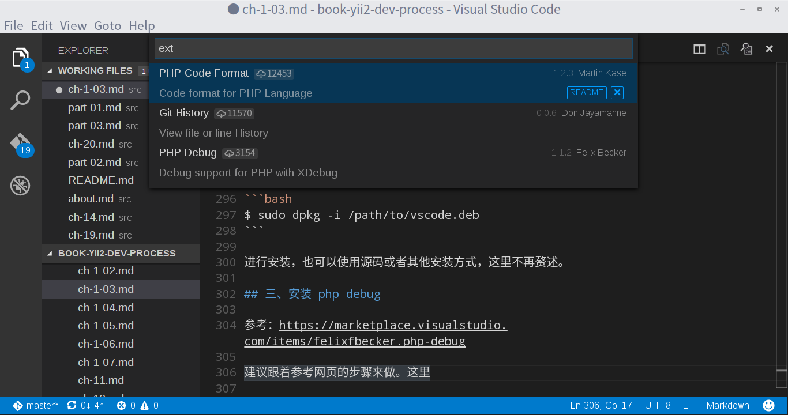

# 第三章 编辑器与调试器

本章编辑器讲主要介绍 vim 和 vscode 两个编辑器，调试器则介绍 xdebug。本章分为两节，分别摘自不同的博客，跟[第一部分](./part-01.md)的其他章节有重复，时间比较紧迫的读者可以只读本章的任意一节，代替第一部分的阅读。

## 第一节 Linux Deepin 下基于 XAMPP,VIM,DBGp,Xdebug 搭建 Yii2 运行平台

* 原网址：[http://my.oschina.net/bubifengyun/blog/469235](http://my.oschina.net/bubifengyun/blog/469235)

部分内容有改动。如有变动以原网址为准。

### 引言

Yii1.1 的搭建过程见[这里](http://my.oschina.net/bubifengyun/blog/342130)。下面做少许改动，加入`composer`部分，使之用于 Yii2。

选择Linux桌面环境 Deepin 15 下开发网站的理由很简单，能截图，有搜狗输入法，可以WPS文档记录，终端下复制粘贴很容易，相比ubuntu,fedora死机次数少了，对，就是不用折腾，自带的。

### 一、vim和DBGp插件

Deepin 15 简体中文，自带的 vim7.4 版本，很多配置已经很适合大陆的人使用了，比如 Php 和 Python 的调试支持等，不需要重新编译了。可以节省不少步骤。

这里([http://my.oschina.net/bubifengyun/blog/163516](http://my.oschina.net/bubifengyun/blog/163516))提供一个 vim 的配置文件，已经自带了 DBGp 这个 vim 的插件，在 *~* 文件夹下解压缩，得到 *~/.vim* 和 *~/.vimrc* 文件，就已经在 *~* 文件夹下了。 注意，复制之前做好你文件的备份，复制完毕后，命令

```bash
$ ll ~
```

查看是否有 *~/.vim* 和 *~/.vimrc* 这两个文件，还需要安装一下 `cscope` 和 `ctags` ，就可以了。你用vim随便打开一个文件，比如

```bash
$ vim test.php
```

，如果没有提示其他错误说明这个配置文件暂时适合你了。

### 二、xampp

xampp 专为 php 开发设计，需要的 apache，mysql，php 已经自带了。特别提醒，请下载 PHP 版本高于 5.4 支持 Yii2.0 的 xampp。 这个网上很容易下到 xampp for linux 的版本，我下载的就是 *xampp-linux-x64-<>-install.run* 的文件 ，使用

```bash
$ sudo <path-to>/xampp-linux-x64-<>-install.run
```

就可以了（如果没有执行权限，自己加
`$ chmod a+x <path-to>/xampp-linux-x64-<>-install.run`
）。下面基本是傻瓜式安装。

安装好后，如果没有启动，可以采用如下命令启动。

```bash
$ sudo /opt/lampp/lampp restart
```

或者提示你启动成功了，你可以打开浏览器，在地址栏输入 `localhost` 回车，应该会跳转到 [http://localhost/xampp/](http://localhost/xampp/)，如跳转成功则说明你安装 xampp 成功了。

需要注意一下几点，你的网站的根目录在 */opt/lampp/htdocs*。 也就是说，你的 *xxx.php* 文件要想被浏览器解析，必须放到 */opt/lampp/htdocs* 下。 或者说 http://localhost/ 就是 */opt/lampp/htdocs/* 文件。 例如你在 */opt/lampp/htdocs/* 下新建了一个文件夹 *www*，其下有 *xxx.php* 文件，也就是 */opt/lampp/htdocs/www/xxx.php* 是这个文件， 你如果想在浏览器里查看这个 *xxx.php*，就可以在浏览器里输入 `http://localhost/www/xxx.php` 了。php 具体教程网上或者其他书籍上很多。这里不再赘述。

### 三、xdebug

最新 PHP 5.6 版的 xampp 自带了 xdebug.so 文件。你可以采用如下命令查找。

```bash
$ sudo find /opt/lampp -name xdebug.so
```

你可以看到类似 */opt/lampp/lib/php/extensions/no-debug-non-zts-20131226/xdebug.so* 的文件。


### 四、配置 *php.ini* 文件

下面参照这里，对应 xampp，可以使用如下几个步骤来配置。

* 1 root 权限打开编辑 xampp 的 *php.ini* 文件，*/opt/lampp/etc/php.ini*

```bash
$ sudo vi /opt/lampp/etc/php.ini
```

当然你也可以使用其他编辑器打开。

* 2 在文中搜索 zend_extension，应该可以看到有一条注释掉的代码，如下

```
;zend_extension=opcache.so
```

或者其他的比如

```
; Module Settings ;
```

的东西，我是在

```
;zend_extension=opcache.so
<这两行代码之间，插入代码>
; Module Settings ;
```

插入的代码如下：<span style="color: rgb(255, 0, 0);">下面这段xdebug的配置有待优化</span>

```
zend_extension=/opt/lampp/lib/php/extensions/no-debug-non-zts-20131226/xdebug.so
; should be your file name

[debug]
; Remote settings
xdebug.remote_autostart=on
;i dislike input ?XDEBUG_SESSION_START=1 in web
xdebug.remote_enable=on
xdebug.remote_handler=dbgp
xdebug.remote_mode=req
xdebug.remote_host=localhost
xdebug.remote_port=9000
;this 9000 is from debugger.vim

; General
xdebug.auto_trace=off
xdebug.collect_includes=on
xdebug.collect_params=off
xdebug.collect_return=off
xdebug.default_enable=on
xdebug.extended_info=1
xdebug.manual_url=http://www.php.net
xdebug.show_local_vars=0
xdebug.show_mem_delta=0
xdebug.max_nesting_level=100
;xdebug.idekey=

; Trace options
xdebug.trace_format=0
xdebug.trace_output_dir=/tmp
xdebug.trace_options=0
xdebug.trace_output_name=crc32

; Profiling
xdebug.profiler_append=0
xdebug.profiler_enable=0
xdebug.profiler_enable_trigger=0
xdebug.profiler_output_dir=/tmp
xdebug.profiler_output_name=crc32
```

* 3 保存退出。

* 4 重启 apache,我是采用如下命令:

```bash
$ sudo /opt/lampp/lampp restart
```

### 五、一个简单的调试例子

下面默认你已经打开 apache 了。如果未打开，

```bash
$ sudo /opt/lampp/lampp restart
```

参考文献：[https://github.com/brookhong/DBGPavim](https://github.com/brookhong/DBGPavim)

* 1 在 */opt/lampp/htdocs/* 文件夹下，新建一个文件夹 *www*，

```bash
$ sudo mkdir /opt/lampp/htdocs/www
```

把他改为自己的文件夹。

```bash
$ sudo chown <my-user-name> /opt/lampp/htdocs/www
```

* 2 新建一个文件 *test.php*

```bash
$ vim /opt/lampp/htdocs/www/test.php
```

输入如下代码

```php
<?php
$text='helloworld';
echo $text;
```

* 3 在`echo`那行，vim命令模式下:w保存，:Bp设置断点，F5运行。

* 4 打开浏览器输入 [http://localhost/www/test.php](http://localhost/www/test.php)，回车。

* 5 切换回到 vim 的界面。可能需要按 F5，进入调试界面，把光标移到 `$text`（两个中的任意一个），按 F12，应该可以看到 `$text` 的内容了。如下图。


* 6 F2,F3 为单步调试，有点小区别，自己感受吧。

### 六、安装 composer

* 1 创建PHP的系统链接。这里假设你电脑没有直接安装PHP，只有 */opt/lampp/bin* 里面有php程序。

```bash
$ sudo ln -s /opt/lampp/bin/php /usr/local/bin/php
```

* 2 安装 `composer` 安装的方法有很多，下面介绍一种。

直接在线安装的。

```bash
$ cd /opt/lampp/bin
$ sudo curl -sS https://getcomposer.org/installer | php
```

该安装可能会爆出问题，部分解决方案见[第二章](./ch-1-02.md)。

* 3 创建 composer 系统链接

```bash
$ sudo ln -s /opt/lampp/bin/composer.phar /usr/local/bin/composer
```

`composer` 命令就安装好了。

### 七、Yii2框架的使用和调试

说实在的composer的安装太头疼了。网速很慢。强烈建议采用直接下载安装包，然后在网站根目录下解压缩，最后再配置composer用来更新部分插件。为了以后方便，下面按部就班的做记录。

切换到网站根目录（xampp的为 */opt/lampp/htdocs/*),本人一直习惯在下面再建一个文件夹叫 *www*，详细说明见上文。

```bash
$ cd /opt/lampp/htdocs/www/
$ composer global require "fxp/composer-asset-plugin:^1.2.0"
```

接下来下载 basic,其实我更愿意直接下载 basic 的压缩包，然后解压缩在这里。为了不必要的装，下面用 `composer` 一把。

```bash
$ composer create-project yiisoft/yii2-app-basic basic 2.0.8
```

如果不出错，等段时间应该会有这样的字样跳出。

```
    Could not fetch https://api.github.com/repos/RobinHerbots/jquery.inputmask/contents/bower.json?
    ref=4551607fef63fd4bcd675479a8c347b668b915eb, please create a GitHub OAuth token to go over the API rate limit
    Head to https://github.com/settings/tokens/new?scopes=repo&description=Composer+on+litianci-pc+2015-06-21+1655
    to retrieve a token. It will be stored in "/home/litianci/.composer/auth.json" for future use by Composer.
    Token (hidden):
```

看英文的意思是： 给你了一个网址(Head to 后面的是网址)，让你去这个网址用自己的 github 账号登录，得到一个令牌数，再回来吧这个令牌数贴在下面。 还特别提示你这个令牌数贴进去的时候是看不到的。按着他们说的做，就可以继续进行下去了。

简单的调试一下。

网上，Yii 的论坛实在资料太丰富了，随便做网站。使用 vim+xampp+xdebug+dbgp 类调试 php,yii 框架，现在就容易多了。

下面做个说明。

比如想调试 *./protected/controllers/Helloworld.php* 文件下的 `actionHelloworld()` 函数里面的部分语句，可以光标停留在这一行，
点击 F9 或者 vim 命令行 `:Bp` 在这里设置断点，然后点击 F5 运行。 

跳转到浏览器，打开某个网页会调用 `actionHelloworld` 函数的，浏览器应该会卡在这里。

回到vim的代码界面，点击F2等逐步调试就可以了。

### 附录 插图


文中可能有说的不明白的见谅。可以 bubifengyun@sina.com 联系。

原文链接：http://my.oschina.net/bubifengyun/blog/469235

## 第二节 VSCode 的安装及其调试器 Xdebug 安装

参考网页：
+ https://marketplace.visualstudio.com/items/felixfbecker.php-debug

### 一、引言

VSCode 是微软的跨平台的免费开源编辑器，支持多种语言，其中包括 PHP,HTML,Markdown 等。对于不熟悉 Vim 的用户，不失为一个好的选择。本书中，主要使用 VSCode 做笔记，但在本章主要介绍怎么使用 VSCode 编辑并调试 PHP。

### 二、安装 VSCode

在 Linux Deepin 下有好几种安装方式，最简单的一种是命令行

```bash
$ sudo apt-get install vscode
```

也可以到 VSCode 官网下载最新的 vscode.deb 安装包，使用

```bash
$ sudo dpkg -i /path/to/vscode.deb
```

进行安装，也可以使用源码或者其他安装方式，这里不再赘述。

### 三、安装 php debug

参考：https://marketplace.visualstudio.com/items/felixfbecker.php-debug

建议跟着参考网页的步骤来做。

按下 F1，在上面命令栏输入 `ext install php-debug` 回车即可。

本人安装了如下几个插件
+ php code format
+ git history
+ php debug



### 四、配置 xdebug

安装 xampp 的部分，可以参考第一节的相关内容，xdebug 在 php.ini 中的配置也可以使用上方的配置，当然也可以只写

```config
[XDebug]
xdebug.remote_enable = 1
xdebug.remote_autostart = 1
```

这里从略。记得配置完成后重启 apache, 可用比较粗笨的方法，

```
$ sudo /opt/lampp/lampp restart
```

### 五、调试 PHP

这里 composer 的安装使用以及 Yii 2 模板安装同第一节，不再赘述，单讲调试 PHP 的方法。

使用说明的官方表态
>In your project, go to the debugger and hit the little gear icon. Choose PHP. A new launch configuration will be created for you.
Now, if you select this configuration and hit `F5`, VS Code will listen on port 9000 for incoming XDebug requests.
Now, when you make a request to `localhost` with your webbrowser, XDebug will connect to VS Code and you can debug your PHP.

换个能懂的语言，

1、打开项目中某个源码页面，在需要调试的某行代码前点击加入断点。
 


2、点击左侧 debug 的图标，选择 PHP debug，点击 F5 运行。


3、打开浏览器，输入网址，该网址会调用上述要调试的代码，会看到页面一直在等待。


4、回到源码页面，开始调试代码


### 六、后语

VSCode 的功能还是很强大的，不过可惜的是本人一直把他当做一个笔记本，使用 markdown 记录要做的事情。有时间折腾的人，建议用用 VSCode。除了 Vim 和 VSCode 这两个免费的 PHP 编辑器，还有很多收费的编辑器，比如 PHPStorm 等，由于版权关系，喜欢购买的可以去看看。

## 第三节、自编译 Xdebug
参考网页：
+ https://github.com/xdebug/xdebug

xampp 一般会自带 xdebug, 可以在安装文件夹下搜索 *xdebug* 进行查找。当 xampp 安装包里**无 xdebug **的时候，对于 Windows 系统，可以直接从[这里](https://xdebug.org/download.php)选择合适的版本安装，对于 Linux 系统，则要自行编译了。下面简介自行编译的方法。

### 1、下载源码

```bash
$ git clone git://github.com/xdebug/xdebug.git
```

也可到 https://github.com/xdebug/xdebug/releases 下载最新稳定版本。

### 2、切换到稳定版分支（可跳过）

下载后，进入 *xdebug* 文件夹。如果存在 git，可以切换到稳定开发分支，当然也可以不切换。本文是切换了的。

```bash
$ cd /path/to/xdebug
$ git checkout XDEBUG_2_4_1
HEAD is now at 02a6ecd... Go with 2.4.1
$ git branch
* (HEAD detached at XDEBUG_2_4_1)
  master
```
**解释**
+ `$` 开头的是命令语句，其他开头的为执行结果。
+ 写作本文的时候，最新稳定版为 2.4.1

### 3、编译 xdebug

```bash
$ /opt/lampp/bin/phpize
```

弹出异常缺少 `autoconf`，需要安装 `    yum install m4 autoconf` 才可以继续进行。

```bash
$ ./configure --enable-xdebug --with-php-config=/opt/lampp/bin/php-config
```
这里需要指出的是 *php-config* 在安装包中的位置。

```bash
$ make
```
生成的文件夹在 *./modules/xdebug.so*。该 xdebug 怎么使用，见本书上面说明。