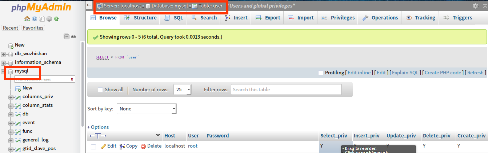
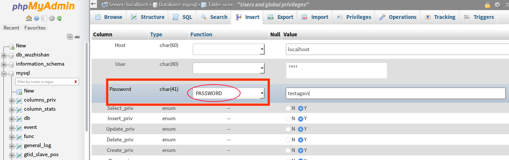
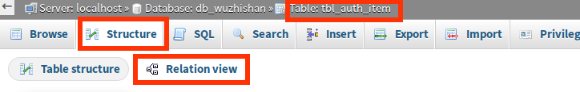
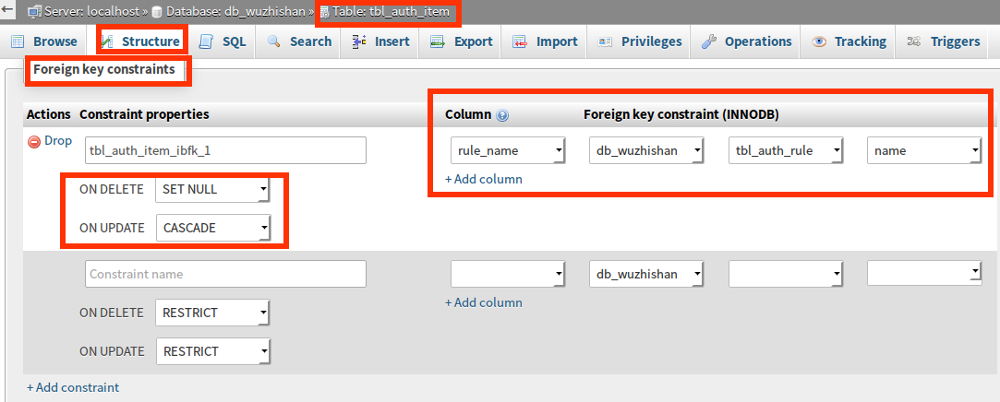
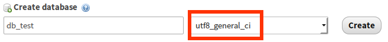
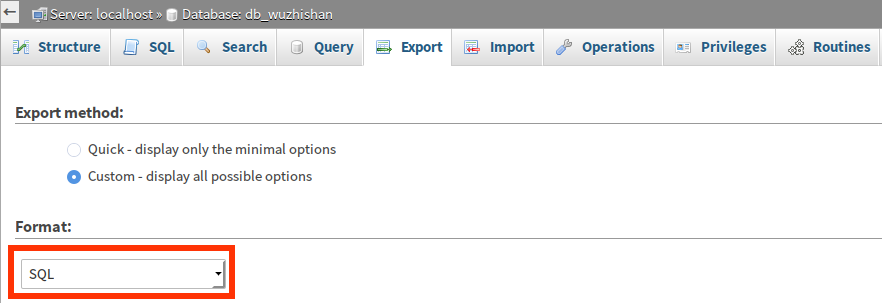
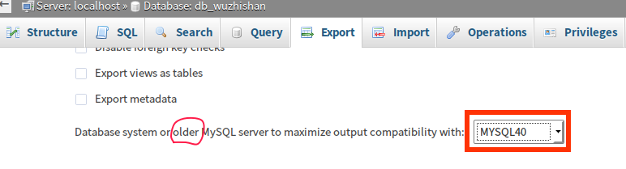
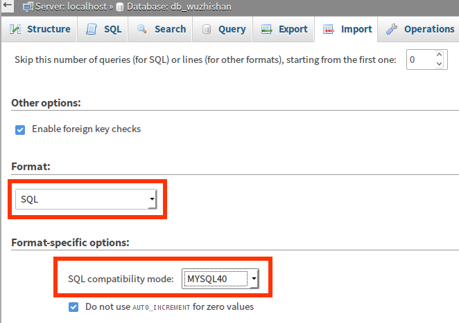
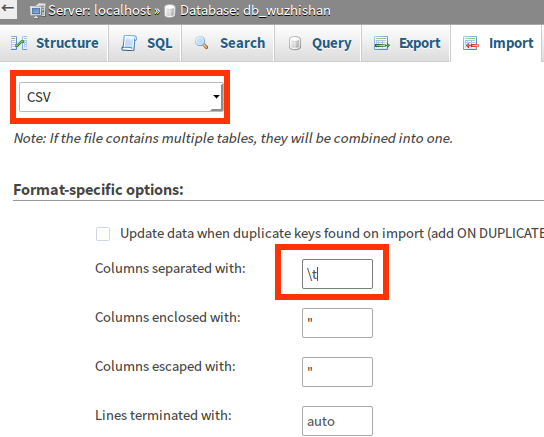

# 第四章 phpMyadmin 部分用法

参考网页：
+ http://v.youku.com/v_show/id_XMTU1NjAzMDAw.html
+ https://www.phpmyadmin.net/

## 引言

在开发网站中，常用的页面之一便是操作数据库。在 xampp 中，使用 phpMyadmin 管理 MySQL 更是家常便饭，图形化操作界面，大部分功能是直接上手的，新手也可以参考[优酷视频-phpMyadmin讲解](http://v.youku.com/v_show/id_XMTU1NjAzMDAw.html)或者[官网](https://www.phpmyadmin.net/)。对于大部分常见的功能，不再赘述，下面将会简介 phpMyadmin 中如下内容。
+ `mysql.user` 数据表中用户的增删读改；
+ 数据库中外键的使用；
+ 在不同版本 MySQL 中互相导入导出 sql 文件，使用统一格式；
+ 从 excel,csv 等格式文件中导入 MySQL；

## 一、数据库用户的增删读改

出于安全考虑，我们需要使用特定的用户名和密码登录数据库，并删除根用户。根据需要多少功能分配多少权限的原则，还常常需要设定特定权限。在 phpMyadmin 可以选择 mysql 数据库的 user 表，直接更改这些用户。



然后对用户表进行增删读改。这里需要注意的是，为了方便，一般密码的修改，会选择 `PASSWORD` 的加密方式。见下图。



## 二、数据库外键简介

参考网页：
+ http://www.cnblogs.com/smyhvae/p/4042303.html
+ http://my.oschina.net/sallency/blog/465079
+ http://www.2cto.com/database/201501/367791.html

本节摘自：http://my.oschina.net/sallency/blog/465079 表示感谢。
外键具有保持数据完整性和一致性的机制，对业务处理有着很好的校验作用。

============================白话文简介=================================

简单来说，若profile表的uid列作为外键user_profile，参考的主表的列（references）为user表的id，且联动删除更新操作（on delete cascade on update 为1的记录为id = 2，则profile表中uid为1的记录也会被联动更新为uid = 2，这样遍保持了数据的一致性。

B存在外键bfk，以A表的ak作为参照，则A为主表，B为从表，A变动将会影响B中作为外键所对应的记录

```sql
alter table `profile` add constraint `user_profile` foreign key (`uid`) \
references `user`(`id`) on delete cascade on update cascade;
```

在profile中为uid列添加名为user_profile的外键，且此外键的参照为user表的id列，关联的操作为删除和更新

=============================正文====================================

1、表引擎必须为InnoDB，MyISAM不支持

2、外键必须建立索引（可以为普通、主键、唯一，事先不建立的话会自动创建一个普通索引），你要用的外键和参照的外表的键，即

```sql
alter table B add constraint `b_foreign_key_name` foreign key (`bfk`) \
references A(`afk`) on delete no action on update no action;
```

时 b_foreign_key_name 为外键名，bfk字段和afk字段都必须存在索引

3、外表为约束表，约束着含有外键的被约束表，即 B 含有一个以 A 作为参考表的外键，则 A 为主 B 为从，弱关联on delete on update等动作，则 A 变更 B 会被变更，B 怎样变 A 不必跟随变动，且表 A 中必须事先存在 B 要插入的数据外键列的值，列如 B.bfk作为外键 参照 A.afk ，则 B.bfk插入的值必须是 A.afk 中已存在的

4、把3所的简单点就是若B有以A作为参照的外键，则B中的此字段的取值只能是A中存在的值，从表B会实时受到主表A的约束，同时若关联on delete on update等操作则当A中的被参照的字段发生delete或update时，B中的对应的记录也会发生delete 或 update操作，完整性。

=============================下面不是引用了=============================

下面以 Yii 2.0 权限管理使用的数据表 `tbl_auth_assignment`、`tbl_auth_item`、`tbl_auth_rule` 为例，使用 phpMyadmin 操作，导出的代码，以及部分截图如下。

```sql
-- phpMyAdmin SQL Dump
-- version 4.5.2
-- http://www.phpmyadmin.net
--
-- Host: localhost
-- Generation Time: Sep 13, 2016 at 04:28 AM
-- Server version: 10.1.9-MariaDB
-- PHP Version: 5.6.15

SET SQL_MODE = "NO_AUTO_VALUE_ON_ZERO";


/*!40101 SET @OLD_CHARACTER_SET_CLIENT=@@CHARACTER_SET_CLIENT */;
/*!40101 SET @OLD_CHARACTER_SET_RESULTS=@@CHARACTER_SET_RESULTS */;
/*!40101 SET @OLD_COLLATION_CONNECTION=@@COLLATION_CONNECTION */;
/*!40101 SET NAMES utf8mb4 */;

--
-- Database: `db_wuzhishan`
--

-- --------------------------------------------------------

--
-- Table structure for table `tbl_auth_assignment`
--

CREATE TABLE `tbl_auth_assignment` (
  `item_name` varchar(64) COLLATE utf8_unicode_ci NOT NULL,
  `user_id` varchar(64) COLLATE utf8_unicode_ci NOT NULL,
  `created_at` int(11) DEFAULT NULL
) ENGINE=InnoDB DEFAULT CHARSET=utf8 COLLATE=utf8_unicode_ci;

--
-- RELATIONS FOR TABLE `tbl_auth_assignment`:
--   `item_name`
--       `tbl_auth_item` -> `name`
--

-- --------------------------------------------------------

--
-- Table structure for table `tbl_auth_item`
--

CREATE TABLE `tbl_auth_item` (
  `name` varchar(64) COLLATE utf8_unicode_ci NOT NULL,
  `type` int(11) NOT NULL,
  `description` text COLLATE utf8_unicode_ci,
  `rule_name` varchar(64) COLLATE utf8_unicode_ci DEFAULT NULL,
  `data` text COLLATE utf8_unicode_ci,
  `created_at` int(11) DEFAULT NULL,
  `updated_at` int(11) DEFAULT NULL
) ENGINE=InnoDB DEFAULT CHARSET=utf8 COLLATE=utf8_unicode_ci;

--
-- RELATIONS FOR TABLE `tbl_auth_item`:
--   `rule_name`
--       `tbl_auth_rule` -> `name`
--

-- --------------------------------------------------------

--
-- Table structure for table `tbl_auth_rule`
--

CREATE TABLE `tbl_auth_rule` (
  `name` varchar(64) COLLATE utf8_unicode_ci NOT NULL,
  `data` text COLLATE utf8_unicode_ci,
  `created_at` int(11) DEFAULT NULL,
  `updated_at` int(11) DEFAULT NULL
) ENGINE=InnoDB DEFAULT CHARSET=utf8 COLLATE=utf8_unicode_ci;

--
-- RELATIONS FOR TABLE `tbl_auth_rule`:
--

--
-- Indexes for dumped tables
--

--
-- Indexes for table `tbl_auth_assignment`
--
ALTER TABLE `tbl_auth_assignment`
  ADD PRIMARY KEY (`item_name`,`user_id`);

--
-- Indexes for table `tbl_auth_item`
--
ALTER TABLE `tbl_auth_item`
  ADD PRIMARY KEY (`name`),
  ADD KEY `rule_name` (`rule_name`),
  ADD KEY `idx-auth_item-type` (`type`);

--
-- Indexes for table `tbl_auth_rule`
--
ALTER TABLE `tbl_auth_rule`
  ADD PRIMARY KEY (`name`);

--
-- Constraints for dumped tables
--

--
-- Constraints for table `tbl_auth_assignment`
--
ALTER TABLE `tbl_auth_assignment`
  ADD CONSTRAINT `tbl_auth_assignment_ibfk_1` FOREIGN KEY (`item_name`) 
  REFERENCES `tbl_auth_item` (`name`) ON DELETE CASCADE ON UPDATE CASCADE;

--
-- Constraints for table `tbl_auth_item`
--
ALTER TABLE `tbl_auth_item`
  ADD CONSTRAINT `tbl_auth_item_ibfk_1` FOREIGN KEY (`rule_name`) 
  REFERENCES `tbl_auth_rule` (`name`) ON DELETE SET NULL ON UPDATE CASCADE;

```





## 三、不同版本 MySQL 的数据传递

**强烈建议：数据都采用 utf8-general-ci 字符集。**



在网站最后部署的时候，遇到这类问题，同样的 MySQL 竟然无法相互导入导出，太坑了。后来发现在导入导出时选择特定的格式(这里以 MYSQL40 为例)即可。

导出的时候，





导入的时候，



## 四、导入 excel、csv 文件到 MySQL

参考网页：
+ http://my.oschina.net/bubifengyun/blog/679149
+ http://www.cnblogs.com/latifrons/archive/2012/09/07/2675141.html

开发网站中，采用 PHPExcel 可以直接处理 Excel 的。在涉及网站部署时，需要把各种格式的已有资料，比如各种样式的 Excel 表格，导入到数据库，为了提高效率，发现直接编辑 Excel ，然后全选，复制到一个 `txt` 文件，修改编码为 `utf8` 并改文件后缀为 `.csv` 。直接导入 MySQL 即可。部分操作见下图。



**解释**：
+ 由于 CSV 文件的分隔符是 '\t' ，也即 tab 键，所以要修改。