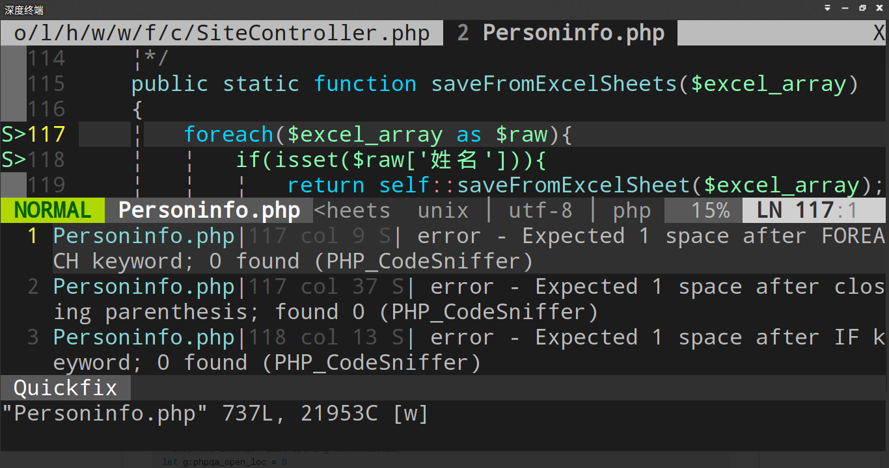

# 第五章 Yii 2.0 编码规范及使用

参考网页：
+ https://github.com/joonty/vim-phpqa
+ http://blog.csdn.net/rainysia/article/details/8773147
+ https://github.com/yiisoft/yii2-coding-standards
+ http://pear.php.net/manual/en/package.php.php-codesniffer.config-options.php
+ http://www.koch.ro/blog/index.php?/archives/63-VIM-an-a-PHP-IDE.html
+ 部分网页，由于是手机查询的，没来得及记录，见谅。

## 一、引言

本章主要介绍 Vim 下的 Yii 2.0 编码规范的制作。其他编辑器下的制作方式，后续有时间的话，会添加，暂时不考虑加入。

## 二、PHP_CodeSniffer 安装

假设我们安装的是 XAMPP，没有直接安装 PHP。
接着[第三章](./ch-1-03.md)做法，建立超链接

```bash
$ sudo ln -s /opt/lampp/bin/php /usr/local/bin/
$ sudo ln -s /opt/lampp/bin/pear /usr/local/bin/
```

**解释**
+ 这样把 XAMPP 已经安装的 PHP 跟 PEAR 作为系统可以直接调用的软件
+ 没有采用配置 PATH 的方式，减少不必要的麻烦。

### 1、安装 imagemagick

```bash
$ sudo apt-get install php5-imagick imagemagick
```

### 2、安装 PHP_CodeSniffer

```bash
$ sudo pear install PHP_CodeSniffer
$ sudo pear channel-discover pear.phpmd.org
$ sudo pear channel-discover pear.pdepend.org
$ sudo pear install --alldeps phpmd/PHP_PMD 
```
### 3、检验 PHP_CodeSniffer

有常用的命令，可以查看 PHP_CodeSniffer 的安装情况。
一般通过上述过程 PHP_CodeSniffer 会安装在 */opt/lampp/bin/phpcs* 和 */opt/lampp/bin/phpmd*, 可以去相应位置查看是否存在上述文件。

```bash
$ /opt/lampp/bin/phpcs -i
```

**解释**
+ 查看已经安装的编码规则

为了方便使用 phpcs,phpcbf，不妨设置链接

```bash
$ sudo ln -s /opt/lampp/bin/phpcs /usr/local/bin/
$ sudo ln -s /opt/lampp/bin/phpcbf /usr/local/bin/
```

**解释**
+ phpcs 检测哪些地方编码不规范
+ phpcbf 修正编码不规范的地方
+ phpmd 检测编码是否存在过大现象
+ 上述命令的具体功能和使用方法，有需要的可以查阅相关资料。
+ 如果 vim 中安装了 synstatic，不建议设置上述链接，因为该插件的 phpcs 可能跟 Yii2 的编码规范冲突。

## 三、安装 Yii2 编码规范

通过上述安装，一般编码规范都是安装在这个文件夹， */opt/lampp/lib/php/PHP/CodeSniffer/Standards/*

可以先下载 yii2-coding-standards 编码规范，

```bash
$ cd
$ git clone git://github.com/yiisoft/yii2-coding-standards.git
```

**解释**
+ 该项目的介绍，本人由于缺乏必要的知识，看的不是很懂。
+ 但是通过查阅相关网页，了解到就是把这个 Yii2 规范放标准编码规范文件夹下。也即

```bash
$ sudo cp -r ~/yii2-coding-standards/Yii2 /opt/lampp/lib/php/PHP/CodeSniffer/Standards/
```

这样就实现了 Yii2 变成了一种编码标准，使用如下命令

```bash
$ /opt/lampp/bin/phpcs -i
```

可以看到类似的结果

> The installed coding standards are PHPCS, Yii2, Zend, Squiz, MySource, PSR2, PEAR and PSR1

上有 **Yii2** 说明 Yii2 编码规范已经成功安装。

## 四、 Vim 中使用 Yii2 编码规范

这里需要安装一个 phpqa.vim 插件，方法如下

### 1、安装 phpqa.vim 插件

编辑 *~/.vimrc* 文件，由于本人的 vim 已经配置了 Bundle 插件管理，故采用如下方式。在 *~/.vimrc* 中，加入如下这句话，

```vim
Bundle 'joonty/vim-phpqa.git'
```

然后在终端运行，

```bash
$ vim +BundleInstall +qall
```

### 2、配置 phpqa

编辑 *~/.vimrc* 文件，加入如下内容，

```vim
" PHP executable (default = "php")
let g:phpqa_php_cmd='/opt/lampp/bin/php'
"
" " PHP Code Sniffer binary (default = "phpcs")
let g:phpqa_codesniffer_cmd='/opt/lampp/bin/phpcs'

let g:phpqa_codesniffer_args = "--extensions=php --standard=Yii2"
"
"" PHP Mess Detector binary (default = "phpmd")
let g:phpqa_messdetector_cmd='/opt/lampp/bin/phpmd'"
```

**解释**
+ 由于开发程序是使用的 XAMPP，故对应的命令都是 */opt/lampp/bin/xxx*
+ `--standard=Yii2` 这个是因为已经实现了 Yii2 编码标准录入。如果没有配置好 Yii2，也可以改为 `--standard=/path/to/yii2-coding-standards/Yii2/ruleset.xml`

## 五、过过眼瘾

上面是本人写的代码，不是很规范，保存时， vim 会提醒哪些地方需要修改。



## 后语

当然除了第四节配置了 vim 下使用 Yii2 编码规范，读者也可以自行摸索在其他编辑器下的配置方法。

如果已经已经写好了代码，想要调整代码规范，不妨使用如下命令

```bash
$ /opt/lampp/bin/phpcbf --extensions=php --standard=Yii2 /opt/lampp/htdocs/www/wuzhishan/ -w
```

**解释**
+ `phpcbf` 是 */opt/lampp/bin/phpcbf* 命令，如果找不到 `phpcbf` ，可以使用 `/opt/lampp/bin/phpcbf` 代替
+ `--standard=Yii2` 是采用 `Yii2` 编码规范对代码进行修改。
+ `/opt/lampp/htdocs/www/wuzhishan/` 是本人编写的网站源码根目录。需要换成你自己的源码目录
+ 上面可以是目录，子目录或者单个文件。
+ 如果上述命令运行提示内存不够，建议对根目录下的子目录逐个进行调整。
+ `-w` 命令表示，对 `warning` 和 `error` 的编码规范都进行修改。
+ 如果存在不懂的，可以使用 `phpcbf --help` 进行查看。

建议最好每次保存的时候都自行修改编码规范，不要等到最后一次性调整，这样的习惯不太好。

由于需要添加很多注释，建议加入 vim 的 PDV (phpDocumentor for Vim) 插件。