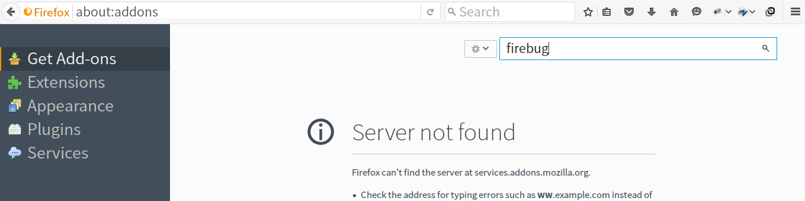
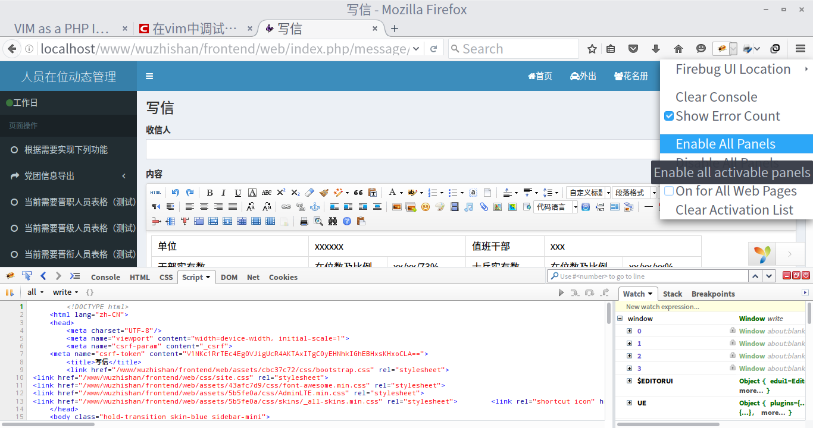
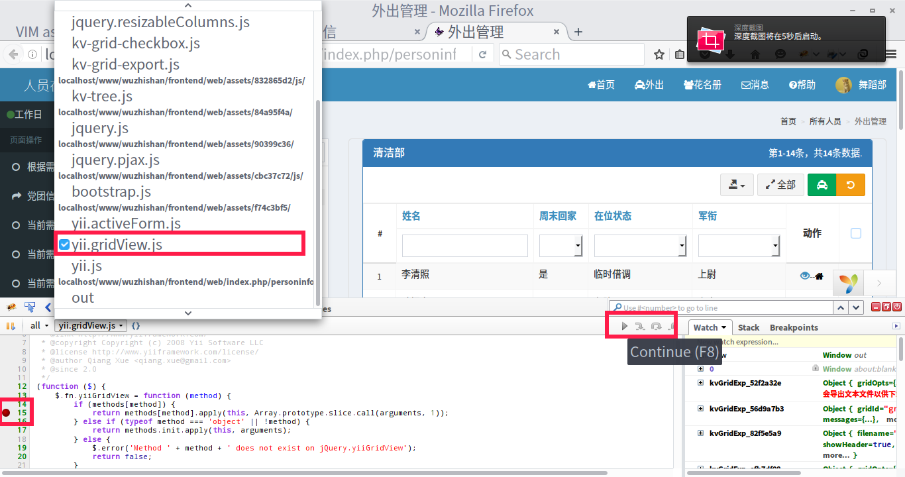

# 第六章 Firebug 安装及简介

参考网页：
+ http://getfirebug.com

## 一、引言

这个火狐浏览器的 Firebug 插件，不记得何时何地看到的了，在调试 PHP 的时候，没有安装也没有感觉有啥不妥。但是要调试 javascript 的时候，发现浏览器没有任何反应，也不知道错误在哪里，遂安装了 Firebug 插件。编写网站的时候，主要用他来调试 javascript，其他功能暂时没有挖掘，有需要的读者可以翻阅相关资料。

## 二、安装

打开火狐浏览器，输入 `about:addons`，进入如下页面

搜索 firebug，然后点击安装即可。请确保 firebug 的版本跟你使用的火狐浏览器兼容。

安装好后，可以在火狐浏览器右上方看到 firebug 的图标。说明安装好了。

## 三、使用

使用的时候，可以直接点击 firebug 的图标，图标会变亮，颜色鲜艳，不再是灰色的。并使能所有的面板，见下图

firebug 的功能很强大，由于本人暂时只需要调试 javascript，下面讲只介绍 javascript 的调试例子，调试其他的方法，请自行查阅相关资料。

### 1、调试 javascript

如下图，在下方 firebug 面板中选择 script, 然后选择需要调试的 javascript 文件，图片中选择的是 yii.gridView.js 文件中的代码作为示例。

在需要添加断点的那行开头，点击一下，即可设置或清除断点。按下 F5 刷新页面，本栏右上方有控制继续前进，逐行或者其他操作的按钮，根据需要进行操作。右侧栏是一些变量。这样就可以实现调试了。

## 后语

本章的目的主要是告诉大家有 firebug 这么一个调试插件，并附带作了最简单的使用介绍。建议有需要的读者可以查阅其他资料来完善这方面的知识。
