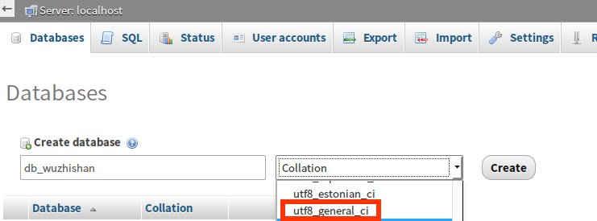

# 第十六章 markdown 语法入门

介绍 gitbook 或者 github 的入门语法。

## Markdown 是什么

Markdown 是一种 Web 上的文本。你可以使用 markdown 控制文档的显示；格式文字为粗体或斜体，添加图像，并创建列表等少数操作。最主要的是 markdown 方便快捷。本书就是采用 markdown 编写的。

你可以使用Markdown大多数地方在GitHub：

## 语法例子

这些例子，你可以使用任何文本文件。

### 1、标题

markdown 语句：
```
# 这是<h1>标签
## 这是<h2>标签
###### 这是<h6>标签
```
显示效果：

<hr>

# 这是&lt;h1&gt;标签
## 这是&lt;h2&gt;标签
###### 这是&lt;h6&gt;标签
<hr>

### 2、斜体与粗体

markdown 语句：
```
*此文本将为斜体*
_这也是斜体_

**这篇文章将是粗体**
__这也是粗体__

_你也把*他们*结合起来_
```
显示效果：

<hr>

*此文本将为斜体*
_这也是斜体_

**这篇文章将是粗体**
__这也是粗体__

_你也把*他们*结合起来_

<hr>

### 3、列表

#### 3.1 无序

markdown 语句：
```
* 项目1
* 项目2
    * 项目2a
    * 项目2b

```
项目2a/b 前为 `tab` 键。显示效果：

<hr>

* 项目1
* 项目2
    * 项目2a
    * 项目2b
<hr>

#### 3.2 有序

markdown 语句：
```
1. 项目1
1. 项目2
1. 项目3
    1. 项目3a
    1. 项目3b
```
显示效果：

<hr>

1. 项目1
1. 项目2
1. 项目3
    1. 项目3a
    1. 项目3b

<hr>

### 4、图像

markdown 语句：

```


```
格式：``

显示效果：

<hr>


<hr>

### 4、链接

markdown 语句：

```
[本书网址](https://github.com/bubifengyun/book-yii2-dev-process)
```
显示效果：

<hr>

[本书网址](https://github.com/bubifengyun/book-yii2-dev-process)

<hr>

### 5、引用

markdown 语句：

```
老子说：
> 天地不仁，以万物为刍狗。
```
显示效果：

<hr>

老子说：
> 天地不仁，以万物为刍狗。

<hr>

### 6、内联代码

markdown 语句：

```
我认为你应该使用`<?=phpinfo() ?>`。
```
显示效果：

<hr>

我认为你应该使用`<?=phpinfo() ?>`。

<hr>

### 7、语法高亮

markdown 语句：

<pre>
```javascript
function fancyAlert(arg) {
  if(arg) {
    $.facebox({div:'#foo'})
  }
}
```
</pre>

显示效果：

<hr>

```javascript
function fancyAlert(arg) {
  if(arg) {
    $.facebox({div:'#foo'})
  }
}
```
<hr>

### 8、表格

markdown 语句：

```

First Header | Second Header
------------ | -------------
Content from cell 1 | Content from cell 2
Content in the first column | Content in the second column

```

显示效果：

<hr>

First Header | Second Header
------------ | -------------
Content from cell 1 | Content from cell 2
Content in the first column | Content in the second column

<hr>

## 后语

这个基本靠摸索，熟练了就知道咋回事了。