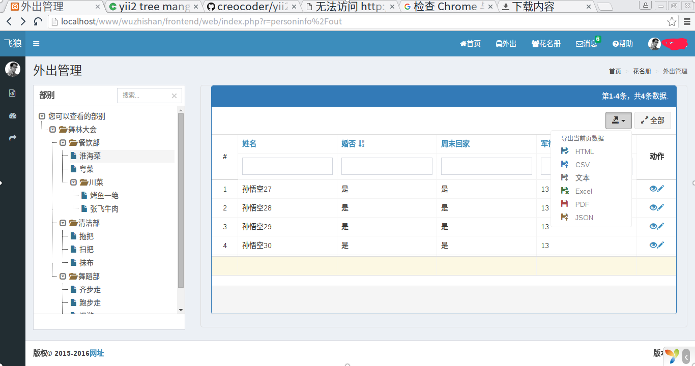

## 第十八章 treeview跟Gridview的结合（有升级版，需要后续添加）

## 一、功能设想

yii2做的网站，一边是树形结构treeview，一边是表格列表gridview，利用kartik的插件，这两个都比较容易搭建起来。选择左边的treeview，根据不同的选择项，girdview显示对应节点的信息。这个功能具有较好的使用价值。

## 二、参考资料

+ https://github.com/neattutorials/yii2-pjax-examples
+ http://blog.neattutorials.com/yii2-pjax-tutorial/
+ https://github.com/kartik-v/yii2-tree-manager
+ http://demos.krajee.com/tree-manager
+ https://github.com/kartik-v/yii2-grid

## 三、完成步骤

总共花了两周时间才完成，中间查了很多资料，不一一记录了。由于时间较长，可能部分内容缺失，如果无法工作，欢迎在下面留言。总体流程是如下：安装tree manager的treeview，=》对treeview显示内容进行改动，=》把显示内容更改为gridview，=》修复gridview出现的各种问题。

### 1、安装tree manager 和 girdview

```bash
composer require kartik-v/yii2-tree-manager "@dev"
composer require kartik-v/yii2-grid "@dev"
```
### 2、数据库的导入

找到`./vendor/kartik-v/yii2-tree-manager/schema/tree.sql`文件，由于本人是xampp开发，使用phpmyadmin，
进入到工作用的`db_lhpg`，点击导入按钮，选择该文件导入即可。导入后，可以根据自己需要在`tbl_tree`添加部分项，或者修改部分备注。
最好不要删除原有的项。我把添加好的`tbl_tree`更名为`tbl_unit`了，没有做任何添加。

### 3、创建模型Model

可以使用gii自动生成工具，Model命名空间为`common/models`。修改`./common/models/Unit.php`文件（对应你生成的文件），修改内容如下。

```php
namespace common\models;

use Yii;

class Unit extends \kartik\tree\models\Tree
{
/*略*/
}
```

### 4、创建Module

这部分内容比较多。

+ 创建文件夹modules,`mkdir ./frontend/modules`
+ 复制模块内容到modules文件夹，`cp -r ./vendor/kartik-v/yii2-tree-manager ./frontend/modules/tree`
+ 把`./frontend/modules/tree`文件夹下所有.php文件的命名空间`namespace kartik\tree` 改为`namespace frontend\modules\tree`；
包括那些`namespace kartik\tree\controllers`等类似的命名空间。
+ 修改配置文件`./frontend/config/main.php`,加入如下内容。

```php
'modules' => [
   'treemanager' =>  [
        'class' => '\frontend\modules\tree\Module',
    ]
]
```

### 5、使用TreeView插件

假设现有一个Personinfo,对应有`PersoninfoController`的动作

```php
    /**
     * Every User take control of Out in special unit.
     * @return mixed
     */
    public function actionOut()
    {
        $see_unit = Yii::$app->user->identity->see_unit;
        
        // add children and itself.
        $query = Unit::findOne($see_unit)
            ->children()
            ->orWhere(['id' => $see_unit])
            ->addOrderBy('root, lft');
            
        $current_unit = Yii::$app->session->get('current_unit', 0);
        if ($current_unit === 0){
            $current_unit = $see_unit;
        }

        return $this->render('out', [
            'query' => $query,
            'current_unit' => $current_unit,
        ]);
    }
```

**解说：**
+ 网站通过[http://localhost/www/wuzhishan/frontend/web/index.php?r=personinfo%2Fout](http://localhost/www/wuzhishan/frontend/web/index.php?r=personinfo%2Fout)访问
+ 由于是针对特定用户有特定的查看权限，所以首先获取查看权限`$see_unit`
+ `$query`是提供给TreeView使用的变量.
+ `children()`函数见[yii2-nested-sets](https://github.com/creocoder/yii2-nested-sets)的说明。
+ `$current_unit`是当前正在查看的变量。
+ 这里如果`$current_unit`不在可查看权限`$see_unit`的权限范围内的话，是0或者其他数值，则只显示根目录的数值。
+ 需要特别说明的是`Yii::$app->session->get('current_unit', 0);`用于每次刷新，把上次点击的内容复制过来。也就是需要其他地方设置
`Yii::$app->session->set('current_unit', $current_unit);`这个在下面说。

下面说渲染的页面`./frontend/views/personinfo/out.php`,代码如下：

```php
<?= TreeView::widget([
    'query'             => $query,
    'headingOptions'    => ['label' => '部别'],
    'nodeView'          => '@frontend/views/personinfo/_nodegridview',
    'nodeActions' => [
        Module::NODE_MANAGE => Url::to(['/treemanager/node/my-manage']),
    ],
    'isAdmin'           => false,
    'rootOptions'       => ['label' => '您可以查看的部别'],
    'displayValue'      => $current_unit,
    'toolbar'           => [
        TreeView::BTN_REFRESH => false,
        TreeView::BTN_CREATE => false,
        TreeView::BTN_CREATE_ROOT => false,
        TreeView::BTN_REMOVE => false,
        TreeView::BTN_SEPARATOR => false,
        TreeView::BTN_MOVE_UP => false,
        TreeView::BTN_MOVE_DOWN => false,
        TreeView::BTN_MOVE_LEFT => false,
        TreeView::BTN_MOVE_RIGHT => false,
        TreeView::BTN_SEPARATOR => false,
	],
]) ?>
```

**解说：**
+ `$query`见controller传过来的变量。
+ 这里对`nodeView`重新赋值了。为`@frontend/views/personinfo/_nodegridview`，请一定把路径写完，否则无法找到该页面。
+ `nodeActions`只修改了`NODE_MANAGE`，经多轮测试，一直没有找到好的解决方案，只好修改Module里源代码了，这也是把原来Module内置到frontend的原因。
+ `toolbar`被禁用了，但是还是那么操蛋，必须要一个个的赋值为false才可以。
+ 有不懂的请参考该插件的文档：http://demos.krajee.com/tree-manager

`Module::NODE_MANAGE => Url::to(['/treemanager/node/my-manage'])`中的`my-manage`的解说，
在 `./frontend/modules/tree/controllers/NodeController.php`文件中，
该动作对应于`actionMyManage`函数。内容如下。

```php
    /**
     * View a tree node via ajax
     *
     * @return redirect to `/personinfo/out`
     */
    public function actionMyManage()
    {
        extract(static::getPostData());
        if (isset($id) && !empty($id)) {
            Yii::$app->session->set('current_unit', $id);
        }
        return $this->redirect(['/personinfo/out']);
    }

```

**解说：**
+ 这个是一种折衷做法，本来希望`Module::NODE_MANAGE => Url::to(['/frontend/personinfo/out'])`的，但是各种调试失败，做了如下折中。
首先读取`$_POST`的内容，主要是点击TreeView树形结构节点Node获得`id`，然后刷新网页`['/personinfo/out']`，
把获得的`id`传递过去，传递方式采用的session方式。

下面把`./frontend/views/personinfo/_nodegridview.php`的内容贴出来。

```php
<?php

use yii\helpers\Html;
use yii\widgets\ActiveForm;
use yii\widgets\Pjax;
use kartik\grid\GridView;
use kartik\tree\TreeView;
use common\models\Personinfo;
use common\models\PersoninfoSearch;
use common\models\Unit;

/* @var $this yii\web\View */
/* @var $model common\models\Personinfo */
/* @var $form yii\widgets\ActiveForm */

Pjax::begin();
// run every key=>value as variant in PHP.
extract($params);

$children = Unit::findOne($node->id)->children()->all();
$selfAndChildrenID = [$node->id];
foreach($children as $child){
    $selfAndChildrenID[] = $child->id;
}

$searchModel = new PersoninfoSearch();
$searchModel->unit_code = $selfAndChildrenID; 
$dataProvider = $searchModel->search(Yii::$app->request->queryParams);

echo GridView::widget([
    'id' => 'admin-gridview-id',
    'dataProvider' => $dataProvider,
    'filterModel' => $searchModel,
    'columns' => [
        [
            'class' => 'kartik\grid\SerialColumn'
        ],
        'name',
        'is_married',
        'can_home_weekend',
        'mil_rank',
        [
            'class' => 'kartik\grid\ActionColumn',
            'template' => '{view}{update}',
        ],
    ],
    'containerOptions' => ['style'=>'overflow: auto'], // only set when $responsive = false
    'toolbar' =>  [
        '{export}',
        '{toggleData}'
    ],
    'pjax' => true,
    'bordered' => true,
    'striped' => false,
    'condensed' => false,
    'responsive' => true,
    'hover' => true,
    'floatHeader' => true,
    'floatHeaderOptions' => ['top' => 10],
    'showPageSummary' => true,
    'panel' => [
        'type' => GridView::TYPE_PRIMARY
    ],
]);
Pjax::end();
```

**解说：**
+ `params`是通过动作传过来的一个变量，知道内有一个`node`就可以了，`node`是`Unit`的一个实例或者说是一个对象。
+ `$searchModel->unit_code = $selfAndChildrenID;`设置该语句的时候，其中`$selfAndChildrenID`是数组array。
需要设置`searchPersoninfo`的`rules`的规则，`unit_code`是`safe`。Yii2会实现自动搜索所有归属这些单位的人员。
+ 其他解释见文档：https://github.com/kartik-v/yii2-grid 及相关说明。

调试发现，每次点击gridview的排序，都没有任何东西放在post变量里，这个问题需要好好解决。

这样就实现了一边是树形结构TreeView，一边是表格GridView，且GirdView可以调节改动。可以根据自己的需要，排序搜索GridView的内容。

## 四、值得完善之处

在花费两周的时间才解决这个问题时，设想了很多方案，比如把原作者的这个模块给肢解了，各自放到frontend里。
当然最好的方案是把这个模块留在`./vendor`文件夹里，不需要对他做任何改动。只是修改
`Module::NODE_MANAGE => Url::to(['/frontend/personinfo/out']),`，然后配置一下Controller里的ActionOut函数。
由于缺乏时间对此进行更深的研究，先留存在这里。

树形结构的数据来源是采用原作者提供的TreeView添加的。

## 五、贴一张图来过过瘾。



## 六、源代码

网站正在紧锣密鼓的开发中，后期会开源。

# 改版说明

由于脑残，更新系统了，导致上述页面打开错误，下面介绍在一定程度上不受插件更新影响的办法。

通过仔细观察上述代码，需要修改的 *module* 内容并不多。实际上只有如下几部分需要修改，也即上面`第四点 值得完善之处`的内容。下面叙述一个完整的内容。
