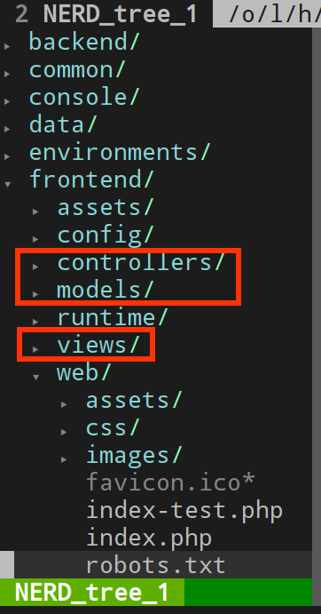
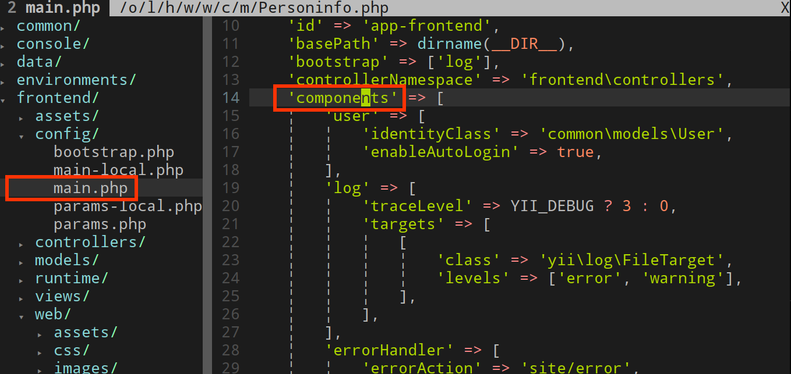

# 第一章 Yii 2.0 简介

参考网页：
+ http://www.wikihow.com/Install-XAMPP-on-Linux
+ http://blog.csdn.net/cloudday/article/details/8638946
+ http://jingyan.baidu.com/article/afd8f4de7976b034e286e90c.html

## 一、引言

由于本书的写作目的主要是记录开发过程中遇到的问题。仅对涉及到的相关知识作简要介绍，比如如何安装 composer, Yii2, 搭建 git 服务器等，详细内容请参考 [《The Definitive Guide to Yii 2.0》](http://www.yiiframework.com/doc-2.0/guide-index.html)等书籍。

## 二、下面的都是转载。。。

转载自：http://www.yiichina.com/doc/guide/2.0/intro-yii 调整了一下排版。表示感谢。更详细的内容请阅读如下两本书：
+ The Definitive Guide to Yii 2.0 官方指南，很容易下载到 PDF 版本。
+ Yii PHP Framework Version 2 官方 API，常见为 chm 文件。

<pre>
Yii 是什么

Yii 是一个高性能，基于组件的 PHP 框架，用于快速开发现代 Web 应用程序。 名字 Yii （读作 易）在中文里有“极致简单与不断演变”两重含义， 也可看作 Yes It Is! 的缩写。
Yii 最适合做什么？

Yii 是一个通用的 Web 编程框架，即可以用于开发各种用 PHP 构建的 Web 应用。 因为基于组件的框架结构和设计精巧的缓存支持，它特别适合开发大型应用， 如门户网站、社区、内容管理系统（CMS）、电子商务项目 和 RESTful Web 服务等。
Yii 和其他框架相比呢？

如果你有其它框架使用经验，那么你会很开心看到 Yii 所做的努力：

    和其他 PHP 框架类似，Yii 实现了 MVC（Model-View-Controller） 设计模式并基于该模式组织代码。
    Yii 的代码简洁优雅，这是它的编程哲学。它永远不会为了刻板地 遵照某种设计模式而对代码进行过度的设计。
    Yii 是一个全栈框架，提供了大量久经考验，开箱即用的特性： 对关系型和 NoSQL 数据库都提供了查询生成器和 ActiveRecord；RESTful API 的开发支持；多层缓存支持，等等。
    Yii 非常易于扩展。你可以自定义或替换几乎任何一处核心代码。你还会受益于 Yii 坚实可靠的扩展架构，使用、再开发或再发布扩展。
    高性能始终是 Yii 的首要目标之一。

Yii 不是一场独角戏，它由一个强大的开发者团队 提供支持，也有一个庞大的专家社区，持续不断地对 Yii 的开发作出贡献。Yii 开发者团队 始终对 Web 开发趋势和其他框架及项目中的最佳实践和特性保持密切关注， 那些有意义的最佳实践及特性会被不定期的整合进核心框架中， 并提供简单优雅的接口。
Yii 版本

Yii 当前有两个主要版本：1.1 和 2.0。 1.1 版是上代的老版本，现在处于维护状态。 2.0 版是一个完全重写的版本，采用了最新的技术和协议，包括依赖包管理器 Composer、PHP 代码规范 PSR、命名空间、Traits（特质）等等。 2.0 版代表新一代框架， 是未来几年中我们的主要开发版本。本指南主要基于 2.0 版编写。
系统要求和先决条件

Yii 2.0 需要 PHP 5.4.0 或以上版本支持。你可以通过运行任何 Yii 发行包 中附带的系统要求检查器查看每个具体特性所需的 PHP 配置。

使用 Yii 需要对面向对象编程（OOP）有基本了解，因为 Yii 是一个纯面向对象的框架。 Yii 2.0 还使用了 PHP 的最新特性，例如命名空间 和Trait（特质） 。理解这些概念将有助于你更快地掌握 Yii 2.0。
</pre>

## 三、MVC 简介

本节内容节选自，
+ Bill Keck: 《Yii 2 for beginners》第三章
+ Mark Safronov 等《Web Application Development with Yii 2 and PHP》第四章

MVC 是一种设计模式，M(Model) 代表模型，V(View) 代表视图，C(Controller) 代表控制，分别在代码结构中体现，见下图。开发网站时，一般遵循“胖M瘦C”的原则，也即尽量把复杂的事物处理放在模型 M 中，这样在写控制 C 里的代码就比较干练。更多具体内容请查阅相关书籍。

下面介绍 Application Instance 应用实例 `Yii::$app`，以及配置文件中的 Components 构件。

### 1、`Yii::$app`

用户访问网站的时候，都会产生一个应用实例（Application Instance）,有很多重要的全局函数（非 PHP 语言自带的函数）全局变量都需要通过 `Yii::$app` 来访问。这里就不举例子了，记住有这么一个变量就可以啦。

### 2、`components`

这个 `components` 是指配置文件里的 `components`，比如 *./frontend/config/main.php* 以及 *./common/config/main.php* 等文件里的，

`components` 数组下的元素键值 `user`, `log` 等，都可以使用类似 `Yii::$app->user` 方式来访问。这样就可以根据需要设置自己的全局变量。

除了已经阅读了 Yii 2 的官方指南，以及上面这些知识，可以开始干活啦。