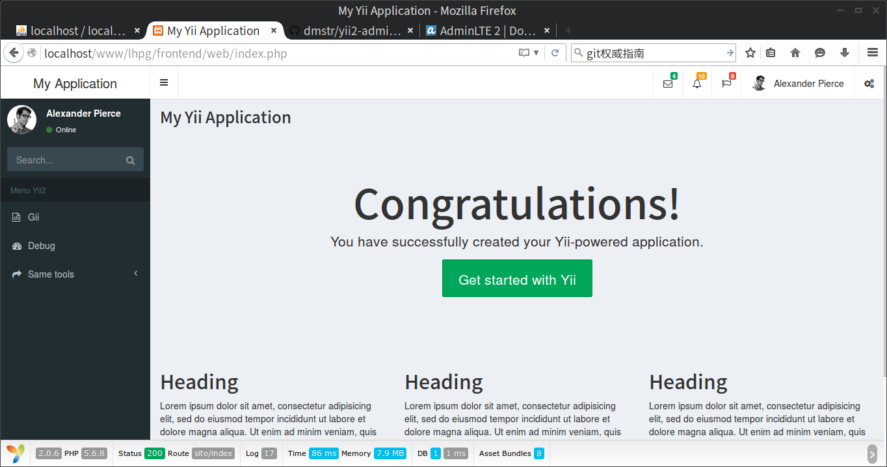

# 第二章 运筹帷幄

原谅我用这么夸张的一个词：运筹帷幄。做网站，前期规划还是很重要的。《孙子兵法》还把庙算放在第一章呢。凡事预则立，不预则废。同时做网站也是个辛苦活，用一副对联时刻提醒自己：

<blockquote class="pull-left">
“有志者事竟成，破釜沉舟，百二秦关终属楚； 
苦心人天不负，卧薪尝胆，三千越甲可吞吴。”

———— 蒲松龄有争议

</blockquote>

## 一、领受任务

接到客户提供的开发文档和期望的效果图，谈好日期和要求等。由于是个人做网站，很多要求都是口头上的，而且是大致想法，并没有太多纸质文档。各种进展都是随着开发的进行慢慢协商修改的。效率不高。在开发后期，由于进度太慢，购买了别人已经成熟的产品，几乎宣告了本网站的失败。所幸提供了一些操作界面等方面的参考内容，接下来就是在明知几乎被抛弃的前提下，出于学习的目的，模仿别人已经成熟的界面，完善网站的内容。

## 二、任务分割

根据需求及设计建议，可以分为如下几个模块。用户及权限管理模块、学员录入归档模块、博客模块、消息模块等。对应的各个模块实现的功能如下。

### 2.1 用户及角色权限管理模块

用户的角色可以分为如下五类，教管干部、学员、教员、网管和访客。

- 教管干部，主要指各级领导，比如各级队长等。主要负责成绩等的录入。
- 教员，主要指教员。主要负责计划等的录入。
- 学员，
- 网管，
- 访客。

### 1.1、 按用户类型划分任务

做人员在位状态动态管理系统。不同权限的用户使用不同的用户界面。

+ 用户分为好几类，比如后台管理员、基层管理员、上层管理员、上层休假管理员一、上层休假管理员二等等。
+ 被管理人员也分为好几类。

因为 Yii 2.0 框架高级版本提供了前后台分离的架构，本着减少重复工作量的原则，除了后台管理员分在后台外，其他用户都在前台办公，并根据权限提供不同的操作按钮。整个页面布局相同。

+ 无人使用的基本都是定时任务，交给后台管理，放在 *./console/* 文件夹。
+ 有人使用的后台维护，放在 *./backend/* 文件夹。
+ 有人使用的各种操作，都放在 *./frontend/* 文件夹。根据人员类型的不同，决定页面的不同访问权限。

### 1.2、 按操作类型划分功能

#### 1.2.1 用户设计
进入网站，首先要有登录功能，要实现用户登录。

整体框架应该以人为主要考虑因素，管理者数量稀少，被管理者没有太多登录该网站的必要。应当实现管理者和被管理者的分开存储。

#### 1.2.2 人员录入与删除

“年年岁岁花相似，岁岁年年人不同”，每年人员都会发生变化的。

#### 1.2.3 

处理人员外出，包括休假和短时请假处理。周末回家人员的管理。

#### 1.2. 辅助功能

比如民族信息，省市县跟路途天数等的设计。人物头像更改等。

#### 1.2. 服务性质的功能

多少人满足晋级晋职条件。党员团员情况等。设置单位老板、负责人等。
年度报表，月份报表。单位组织结构管理，辅助管理。法定节假日的推荐设定。

#### 1.2. 消息通知

消息提醒，最近有多少人要回来了。

#### 1.2. 博客功能

发布新闻，或者人员管理的规章制度。

#### 1.2. 定时执行功能

比如数据库备份，防灾。网络安全，权限管理等等。

#### 1.2 网站后台功能

除了超级管理员在网站安装的时候首次注册，其他用户一律由后台管理员注册，不给其他人注册的机会。

网站的一些参数配置。

单位管理

权限管理

用户管理相关的事情。

## 二、任务分析

这是一个人员管理的网站，网上应当有很多相关的公开源码可供参考。
网站设计应当遵循以下原则：

+ 尽可能的使用已有源码，加快进度；
+ 应当仔细、仔细、再仔细的慎重考虑设计数据库表；
+ 前后端分开；
+ 操作界面首先简洁，其次再考虑响应速度；
+ 留有扩展功能的余地；
+ 考虑跟硬件的关系，主要是跟门禁系统的交联。

整体框架应该以人为主要考虑因素，管理者数量稀少，被管理者没有太多登录该网站的必要。应当实现管理者和被管理者的分开存储。
网站还要考虑跟硬件连接。

### 回头重新分析

作为主要开发者，由于要参与网站相关的绝大部分事务，对这个网站的理解如下。

1. “工欲善其事，必先利其器”。当然最开始是个菜鸟，慢慢的学习技术，边学习边开发，确实导致进展缓慢。但是一些非技术性的原因，在网站后期，也就是不怎么需要陌生技术的时候，极大的阻碍了网站的进展。这些非技术因素包括：缺少光盘和刻录机，由于网站运行网络不能直接使用优盘之类的设备，只能使用光盘。光盘和刻录机损坏和缺乏带来的延误，都是连续几天几天的。有时候感觉不可思议，但是这就是事实。另外一个非技术因素是关系协调，虽然领导负总责，但是跟相关人员中的哪一位关系处不好，带来的协调延误，不是整天整天的，也得半天半天的计算。这些非技术因素还包括一些个人的性格：个人感觉自己不够有胆魄，本来这个涉及人员管理的东西，就可能剥夺很多人的“潜利益”,这几天读了两本书《毛泽东和他的二十四位老师》以及《信任的速度·寓言版》，分明感觉，自己交了书中提到的“信任税”，毛的故事告诉一个道理，成事不仅仅需要智慧，还需要很多事情。最后我想提的非技术因素就是硬件了，本来就跑在虚拟机上，性能已经够限制的了，竟然还给了那么一个烂的电脑，连 64 位虚拟机都安装不了，为了跟 64 位的 MS SQL Server 打交道，郁闷的等待了两周，太想骂人了。如果可以重来，一定要把硬件弄好，这都弄得啥破事。
1. Javascript 知识的欠缺。这个是到现在都没有解决的问题。一直没有更好的时间去学习哪怕 Javascript 的一个框架呢？网站的可操作性特别差，只能用很简单很简单的一点 Javascript 的语句，实现非常简单的一些步骤。
1. 这个网站的功能其实不是太复杂，而且很多是相互独立的模块。应当坚持“步步为营，稳扎稳打”的方针，写一点，整理代码一点，测试一点，做完一个模块，再继续下一个功能。不然到头来都是问题，只能慢慢的测试了。
1. 由于后期变故，源代码功能和数据库表格都要跟着变，这个简直无法避免。所以要学会数据库表格变化了，代码跟着变化的技术。

## 三、实现思路

### 3.1、选择开发环境

比较 **ASP.NET** 和 **PHP** (当然还有 **JAVA** )，限于本人爱好，显然 **PHP** （后来购买的别人已经成熟的产品，使用的是 **ASP.NET** ，有源码，造成了后期开发的极大不便）。本着“站在巨人肩膀”的原则，选择框架 *framework* ，可以加快开发速度。接触过 [Yii](https://github.com/yiisoft/yii) ，为了跟上时代，选择 [Yii 2](https://github.com/yiisoft/yii2) 的高级版本 *advanced*。
为了更快的开发，找个现成的源码加以改写，那就 [shi-yang](https://github.com/shi-yang) 的 [iisns](https://github.com/shi-yang/iisns/) 了。

### 2、搜集资料

非常感谢**贺同学**的帮助，在百度之外还能用到更好的搜索引擎来解决问题，这个是利器啊，必须要先说。其他参考资料见[第一部分最后一章](./ch-1-10.md)。以及编写[项目计划书](./appendix-c.md)。很多书籍是后来阅读的，另外 Javascript 的书籍没有阅读参考过，有点小遗憾。

### 3、总体构思

#### 3.1 搭建 Yii 2.0 开发环境和测试环境

现在已经完成开发环境搭建，测试环境由于个人精力有限，暂时不做。

#### 3.2 Yii 2.0 advanced 版本初始化，git 初始化

#### 3.3 开发网站的一般流程

1. 数据库设计
2. 用户登录实现
3. gii数据表生成
4. 其他功能实现
5. 辅助功能实现，比如上传文件等
6. 测试

#### 3.4 框架构思

前台显示页面如下图。

+ 侧边栏主要是针对特定角色的人提供不同的菜单
+ 上面的一栏提供共同的信息，或者是侧边栏的重复
+ 主页面，显示主要内容。

#### 3.5 一个角色一个菜单

根据不同的用户制定不同的菜单项，主体结构是相同的。

#### 3.6 后台设计

+ 参考别人的后台形式
+ 后台的功能有哪些？

#### 3.7 测试

待定。时间不够，可能忽略。

#### 3.8 花90%的时间做剩下10%的工作

+ 优化，试运行

### 4、开发进度安排（现在发现，进度安排完全不靠谱 20160802）

这里略。（20171126）

## 四、开源后

开源后，代码主要为了方便学习，很多功能可能会阉割。毕竟不是专业写代码的，水平有限，但是不怕献丑，还是把他公开了。打算做好做精如下几个功能，并留下实现步骤。

### 4.1 安装该网站的功能

原本是没有这项功能的，看到网上好多开源的网站代码都会有个安装步骤，想模仿做一下。

### 4.2 头像修改功能

比较喜欢这个小功能，特地把他给提溜出来。也能让人赏心悦目的改一改头像啦。

