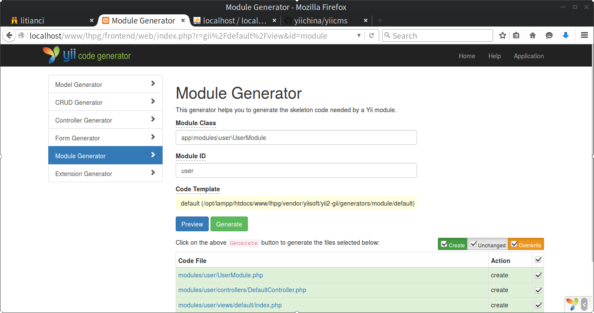

# 第三章 数据表和 Gii 快速搭建网站

参考网页：
+ http://www.uml.org.cn/sjjm/201004284.asp
+ http://bbs.hc3i.cn/thread-122902-1-1.html

## 引言

数据库中表的设计非常重要，是网站稳健运行的基础。但是前期考虑不周、后期新的业务需要等因素，往往需要重建、修改或新增数据表，给网站开发和维护带来了非常大的麻烦。虽然可以使用 git diff 等工具协助修改数据表带来的改动，但是做好前期设计、遵循一些原则还是很有帮助的。具体可以参考[搜索数据库表设计原则](http://bbs.hc3i.cn/thread-122902-1-1.html)。现摘录一部分如下。

+ 拿到任务就开始建立表，但是这绝对是最差的做法;
+ 范式设计，确保表的独立性；
+ 考虑性能，加入关联和冗余；
+ 尽量增加属性，不随意删除属性；
（略）

从上一章的分析可知，当采用管理者和被管理者分离，被管理者无需登录网站的设想，数据表至少需要 `tbl_user` 和 `tbl_personinfo` ，分别用于存储管理者和被管理者。管理者可以登录，可以是一个人或者一个组织。被管理者的信息只是个人信息。在建网之前，我也想了很多，感觉思考的角度有如下几点。

+ 不会画 E-R 图，还是要理清一下整个网站大致的工作过程；


## 一、使用命令行安装

```bash
#进入工作根文件夹
$ cd /opt/lampp/htdocs/www/

# 安装插件
$ composer global require "fxp/composer-asset-plugin:^1.2.0"

# 创建yii2高级版本模板的文件夹wuzhishan
$ composer create-project yiisoft/yii2-app-advanced wuzhishan 2.0.10
```

## 二、初始化模板

下面除非特殊说明，默认操作的文件夹为 `/opt/lampp/htdocs/www/wuzhishan/`。

```bash
$ cd wuzhishan # 进入要开发的文件夹
$ ./init #初始化
```
会出现类似下面这样的内容，做出合适选择即可。

```
  Yii Application Initialization Tool v1.0
  
  Which environment do you want the application to be initialized in?
  
    [0] Development
    [1] Production
  
    Your choice [0-1, or "q" to quit] 0
  
    Initialize the application under 'Development' environment? [yes|no] y
  
    Start initialization ...
```

## 三、加入git版本控制

现阶段只有我一人开发，暂时没必要建立复杂的git仓库管理机制。下面不涉及搭建git服务器的内容。

```bash
$ git init
```

查看需要跟踪哪些文件夹和文件。

```bash
$ git status
```

注意，已经有 *.gitignore* 文件了。
可以看到有很多红色的文件需要添加。可以使用如下命令，全部添加这些文件。

```bash
$ git add .
```

添加完成后，可以使用

```bash
$ git status
```

再次查看，是否有没有添加进来的。

最后做该项目的初始化提交。

```bash
$ git commit -am "初始化网站"
```

并创建分支

```bash
$ git branch ch-2-03-init
```

这样就完成了该项目的版本控制的初始化。建议每天或者每完成一个功能提交一次，便于恢复代码。

## 四、设计数据库的登录用户表

对于使用 MS SQL Server 的用户，且网站运行在 centos 7.x 的用户，可以参考第三部分某章。

### 1、添加数据库 `db_wuzhishan`

在 xampp 中使用 phpmyadmin 创建数据库 `db_wuzhishan`，当前该数据库为空。注意选择的编码方式最好为 **utf8_general_ci**，引擎为 **InnoDB**。如下图。


下面导入该数据库。

打开文件 *./common/config/main-local.php*,编辑 `components['db']`。

```php
'db' => [
            'class' => 'yii\db\Connection',
            'dsn' => 'mysql:host=localhost;dbname=db_wuzhishan',
            'username' => '<your sql user>',
            'password' => '<your password>',
            'charset' => 'utf8',
            'tablePrefix' => 'tbl_',
            'enableSchemaCache' => true,
        ],
```
**解释**
+ 一般 `components['db']` 中 `db` 是可以使用 `Yii::$app->db` 访问。

然后保存。此时如果使用 `git status` 命令，会发现我们的网站没有任何改变。
这是因为 *./common/config/.gitignore* 文件添加了 *main-local.php* 文件，致使 `git` 忽略掉该文件的变化。
出于安全需要，我们不修改 *./common/config/.gitignore* 文件。

xampp 数据库操作部分见本书[第一部分第四章](./ch-1-04.md)。

### 2、导入默认用户表 `tbl_user`

下面运行命令，

```bash
$ ./yii migrate
```

可以自动生成用户表`tbl_user`，如下：

```sql
CREATE TABLE IF NOT EXISTS `tbl_user` (
  `id` int(11) NOT NULL,
  `username` varchar(255) COLLATE utf8_unicode_ci NOT NULL,
  `auth_key` varchar(32) COLLATE utf8_unicode_ci NOT NULL,
  `password_hash` varchar(255) COLLATE utf8_unicode_ci NOT NULL,
  `password_reset_token` varchar(255) COLLATE utf8_unicode_ci DEFAULT NULL,
  `email` varchar(255) COLLATE utf8_unicode_ci NOT NULL,
  `status` smallint(6) NOT NULL DEFAULT '10',
  `created_at` int(11) NOT NULL,
  `updated_at` int(11) NOT NULL
) ENGINE=InnoDB DEFAULT CHARSET=utf8 COLLATE=utf8_unicode_ci;

ALTER TABLE `tbl_user`
  ADD PRIMARY KEY (`id`),
  ADD UNIQUE KEY `username` (`username`),
  ADD UNIQUE KEY `email` (`email`),
  ADD UNIQUE KEY `password_reset_token` (`password_reset_token`);

```

**解释**
+ 由于错误的设置，后面一直用的编码是 `utf8_general_ci`，建议用户可以采用统一的编码方式。

### 3、重新设计用户表 `tbl_user`

考虑到基于角色设计的用户，各个角色的属性不尽相同。

在数据表里无法实现**继承** `inheritance`，下面考虑一种变通的方式在Yii2中实现。

> 采用ActiveRecord的relations的方式，在User跟不同角色之间的矛盾
> 等之间互相索引，以解决登录统一接口跟角色不同之间的矛盾。

参考[通用后台](http://www.yiichina.com/code/344)跟 [iisns](https://github.com/shi-yang/iisns) 的用户表，
结合现实情况，在自动生成的用户表上稍作修改（也可不修改），得到用户表如下。

```sql
CREATE TABLE IF NOT EXISTS `tbl_user` (
  `id` varchar(64) NOT NULL COMMENT '证件号码',
  `username` varchar(255) NOT NULL COMMENT '昵称',
  `auth_key` varchar(32) NOT NULL COMMENT '授权密钥',
  `access_token` varchar(255) DEFAULT NULL COMMENT '访问令牌',
  `password_hash` varchar(255) NOT NULL COMMENT '密码',
  `password_reset_token` varchar(255) DEFAULT NULL COMMENT '密码重置令牌',
  `created_at` datetime DEFAULT NULL COMMENT '创建时间',
  `updated_at` datetime DEFAULT NULL COMMENT '更改时间',
  `last_login_at` datetime DEFAULT NULL COMMENT '上次登录时间',
  `this_login_at` datetime DEFAULT NULL COMMENT '本次登录时间',
  `last_login_ip4` varchar(15) DEFAULT NULL COMMENT '上次登录IP地址',
  `this_login_ip4` varchar(15) DEFAULT NULL COMMENT '本次登录IP地址',
  `email` varchar(255) DEFAULT NULL COMMENT '邮箱',
  `role` tinyint(2) NOT NULL COMMENT '角色',
  `job` varchar(32) DEFAULT NULL COMMENT '职务',
  `see_unit` int(11) DEFAULT NULL COMMENT '查看单位',
  `own_unit` int(11) DEFAULT NULL COMMENT '自己单位',
  `profile` varchar(18) DEFAULT NULL COMMENT '个人简介',
  `status` tinyint(2) NOT NULL COMMENT '状态',
  `is_backend` tinyint(4) NOT NULL DEFAULT '0' COMMENT '是后端用户吗',
  `avatar` varchar(24) DEFAULT NULL COMMENT '照片',
  PRIMARY KEY (`id`),
  UNIQUE KEY `access_token` (`access_token`),
  UNIQUE KEY `email` (`email`),
  UNIQUE KEY `password_reset_token` (`password_reset_token`)
) ENGINE=InnoDB DEFAULT CHARSET=utf8 COMMENT='用户表';
```

### 4、编辑登录用户文件*./common/models/User.php*

最上面的注释部分，需要补充我们新加的部分选项。这里从略。

下面代码部分的修改如下。

```php
@@ -26,6 +31,10 @@ class User extends ActiveRecord implements IdentityInterface
     const STATUS_DELETED = 0;
     const STATUS_ACTIVE = 10;

+    const ROLE_STUDENT = 0;
+    const ROLE_TEACHER = 1;
+    const ROLE_ADMIN = 9;
```

**解释**
+ 上面这段代码，加入角色的分类，比如学员、教员和管理员。

```php
    public function rules()
    {
        return [
            ['status', 'default', 'value' => self::STATUS_ACTIVE],
            ['status', 'in', 'range' => [self::STATUS_ACTIVE, self::STATUS_DELETED]],
+           ['role', 'default', 'value' => self::ROLE_STUDENT],
+           ['role', 'in', 'range' => [self::ROLE_ADMIN, self::ROLE_STUDENT]],
        ];
    }
```

**解释**：上面这段代码，加入角色的适用规则。

```php
    public static function findByUsername($username)
    {
-       return static::findOne(['username' => $username, 'status' => self::STATUS_ACTIVE]
+       if (is_numeric($username)) {
+           $param = 'id';
+       } elseif (strpos($username, '@')) {
+           $param = 'email';
+       } else {
+           $param = 'username';
+       }
+       return static::findOne([$param => $username, 'status' => self::STATUS_ACTIVE]);
    }
```

**解释**：上面这段代码，加入支持`证件号码`，`用户昵称`，`邮箱`登录的功能。
但是这里假设证件号码全是数字，用户昵称不能全是数字，且不包含`@`，一般情况这些条件都能满足。
如果不能满足，请采用默认代码。


现在基本上可以登录了。打开浏览器，输入 http://localhost/www/wuzhishan/frontend/web/，大致会有如下界面，说明你这一步已经成功了。


#### 五、使用 gii 创建用户模块 UserModule

**放在这里不太合适，后面再修改**

在浏览器中输入网址[http://localhost/www/wuzhishan/frontend/web/index.php?r=gii](http://localhost/www/wuzhishan/frontend/web/index.php?r=gii)。

选择**Module Generator**，依次如图输入



Module Class
<table>
    <tbody>
        <tr>
            <td style="word-break: break-all; border-width: 1px; border-style: solid;" valign="top" width="484">
                app\modules\user\UserModule
            </td>
        </tr>
    </tbody>
</table>

Module ID
<table>
    <tbody>
        <tr>
            <td style="word-break: break-all; border-width: 1px; border-style: solid;" valign="top" width="484">
                user
            </td>
        </tr>
    </tbody>
</table>

点击 **Generate** 按钮，可能出错，查看一下，有可能是无创建文件夹权限。可以输入命令，

```bash
$ chmod a+w ./frontend
```

赋予 *frontend* 文件夹以写的权限。

这里解释一下为什么是 *app\modules\user\UserModule*，这完全是按照页面提醒做的，然后试了一下生成代码，果然是的，就这样做了。

然后，按照页面提醒内容，修改*./frontend/config/main.php*，加入

```php

<?php
    ......
    'modules' => [
        'user' => [
            'class' => 'app\modules\user\UserModule',
        ],
    ],
    ......

```

**注意**：添加的时候，`modules` 跟 `components` 同一层次。

## 五、时区和语言设置

假设本网站不支持多语言，仅有简体中文，而且时区是北京东八区，则可以如下设置 *./common/config/main.php*

```php
<?php
return [
    'vendorPath' => dirname(dirname(__DIR__)) . '/vendor',
    'bootstrap' => ['log', 'thumbnail'],
    'language' => 'zh-CN',
    'timeZone' => 'Asia/Shanghai',
    'components' => [
    // 略过大部分代码
    ],

];

```
**解释**
+ `'language' => 'zh-CN'` 设置中文简体；
+ `'timeZone' => 'Asia/Shanghai'` 设置东八区，也即亚洲上海这个时区，北京时区。

## 六、方便调试和生成数据代码

Web Application Development with Yii 2 and PHP, P195部分，插入这里。