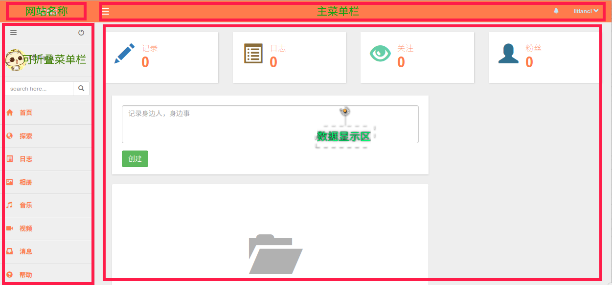

# 第五章 页面布局的实现——界面美化

本章讲美化界面的部分，通过引入主题，国际化语言支持和其他一些技术，实现界面的友好操作。

## 一、设置数据库存储的全局变量

* 本节内容来自网页：[https://github.com/shi-yang/iisns/blob/master/common/components/Setting.php](https://github.com/shi-yang/iisns/blob/master/common/components/Setting.php)

界面中有些全局变量需要频繁调用，且他们放在数据库里比较方便。
为了实现方便调用，可以采用 `component` 方式。
下面完全借鉴[iisns](https://github.com/shi-yang/iisns/blob/master/common/components/Setting.php)的做法，
在网页中通过 `Yii::$app->setting->get('siteName')` 就可以读取全局变量 `'siteName'` 的数值。

### 1、建立数据库中的设置表 `tbl_setting`

可以导入下表。

```sql
CREATE TABLE IF NOT EXISTS `tbl_setting` (
  `key` varchar(255) NOT NULL,
  `value` text NOT NULL
) ENGINE=InnoDB DEFAULT CHARSET=utf8;
```

可以在表中，存储一些全局变量的名字，比如

```sql
INSERT INTO `tbl_setting` (`key`, `value`) VALUES
('siteName', 'iiSNS'),
('version', '2.1.4');
```

`siteName`,`version` 等。加入下面步骤，就可以通过类似 `Yii::$app->setting->get('siteName')` 的方式读取这些数值。

### 2、制作 `component` 子类 `setting`

在文件夹 *./common/components/*，创建类文件 *Setting.php*。

下面全文抄袭
[https://github.com/shi-yang/iisns/blob/master/common/components/Setting.php](https://github.com/shi-yang/iisns/blob/master/common/components/Setting.php)

```php
<?php
namespace common\components;

use yii\base\Component;
use yii\caching\Cache;
use Yii;

class Setting extends Component
{
    /**
     * @var Cache|string the cache object or the application component ID of the cache object.
     * Settings will be cached through this cache object, if it is available.
     *
     * After the Settings object is created, if you want to change this property,
     * you should only assign it with a cache object.
     * Set this property to null if you do not want to cache the settings.
     */
    public $cache = 'cache';

    /**
     * To be used by the cache component.
     *
     * @var string cache key
     */
    public $cacheKey = 'settings';

    /**
     * Holds a cached copy of the data for the current request
     *
     * @var mixed
     */
    private $_data = null;

    /**
     * Initialize the component
     *
     * @throws \yii\base\InvalidConfigException
     */
    public function init()
    {
        parent::init();

        if (is_string($this->cache)) {
            $this->cache = Yii::$app->get($this->cache, false);
        }
    }

    /**
     * Get's the value for the given key.
     * You can use dot notation to separate the section from the key:
     * $value = $settings->get('key');
     * are equivalent
     *
     * @param string $key
     */
    public function get($key)
    {
        if ($this->_data === null) {
            if ($this->cache instanceof Cache) {
                $this->cache->cachePath = Yii::getAlias('@app/../common/cache');
                $data = $this->cache->get($this->cacheKey);
                if ($data === false) {
                    $data = $this->getData();
                    $this->cache->set($this->cacheKey, $data);
                }
            } else {
                $data = $this->getData();
            }
            $this->_data = $data;
        }
        return $this->_data[$key];
    }

    /**
     * Set value
     * @param array $date
     */
    public function set($date)
    {
        foreach ($date as $key => $value) {
            Yii::$app->db->createCommand()->update('{{%setting}}', [
                'value' => $value
            ], '`key`=:key', [':key' => $key])->execute();
        }

        $this->clearCache();
        return true;
    }

    /**
     * Clears the settings cache on demand.
     * If you haven't configured cache this does nothing.
     *
     * @return boolean True if the cache key was deleted and false otherwise
     */
    public function clearCache()
    {
        $this->_data = null;
        if ($this->cache instanceof Cache) {
            $this->cache->cachePath = Yii::getAlias('@app/../common/cache');
            return $this->cache->delete($this->cacheKey);
        }
        return true;
    }

    /**
     * Returns the data array
     *
     * @return array
     */
    public function getData()
    {
        $settings = Yii::$app->db->createCommand("SELECT * FROM {{%setting}}")->queryAll();
        return \yii\helpers\ArrayHelper::map($settings, 'key', 'value');
    }
}

```

### 3、配置 `component` 子类 `setting`

**注意：** 

一定要给 *./common/cache* 文件夹赋予足够的权限，

```bash
chmod o+wx -R ./common/cache
```

否则，很有可能出现设置了但是无法实时更新数据的情况。
这是因为 `clearCache` 无法删除对应的文件。


编辑 *./common/config/main.php*

```php
    'components' => [
        ......
        //  加入下面这三行。
        'setting' => [
            'class' => 'common\components\Setting',
        ],
        ......
    ],
```

告诉 `Yii2` 可以使用 `Yii::$app->setting->get('siteName')` 读取全局变量。

### 4、使用全局变量

可以在网页底部显示网站名称 `siteName`，编辑 *./frontend/views/layouts/main.php*

```php
<footer class="footer">
    <div class="container">
        <p class="pull-left">&copy; <?= Yii::$app->setting->get('siteName') ?></p>
        <p class="pull-right"><?= Yii::powered() ?></p>
    </div>
</footer>
```

即可在页面下显示网站名称 `siteName`。

## 二、国际化支持

详情参阅该插件的github地址：https://github.com/lajax/yii2-translate-manager

### 1、安装插件 `lajax/yii2-translate-manager`

使用命令行安装。

```bash
$ composer require --prefer-dist lajax/yii2-translate-manager "1.*"
```

### 2、创建数据表

```bash
$ ./yii migrate/up --migrationPath=@vendor/lajax/yii2-translate-manager/migrations
```

聚合之后，查看数据库`db_lhpg`，可以看到增加了三个表，

+ `tbl_language`
+ `tbl_language_source`
+ `tbl_language_translate`

并有其他一些操作。

### 3、配置`components`和`modules`

为了方便前后台共用翻译，配置*./common/config/main.php*文件

```php
'language' => 'zh-CN',
'modules' => [
    'translatemanager' => [
        'class' => 'lajax\translatemanager\Module',
    ],
],
'components' => [
    'i18n' => [
        'translations' => [
            '*' => [
                'class' => 'yii\i18n\DbMessageSource',
                'db' => 'db',
                'sourceLanguage' => 'en-US', 
                'sourceMessageTable' => '{{%language_source}}',
                'messageTable' => '{{%language_translate}}',
                'cachingDuration' => 86400,
                'enableCaching' => true,
            ],
        ],
    ],
],
```

下面简要说明，默认语言配置为中文`zh-CN`，源语言按习惯采用英文。
采用数据库方式配置翻译。

### 4、翻译数据插入表中。

对数据库 `db_wuzhishan` 操作示例，以后可以方便添加更多。


```sql

INSERT INTO `tbl_language_source` (`id`, `category`, `message`) VALUES
(1, 'frontend', 'Home'),
(2, 'frontend', 'About'),
(3, 'frontend', 'Help');

INSERT INTO `tbl_language_translate` (`id`, `language`, `translation`) VALUES
(1, 'zh-CN', '首页'),
(2, 'zh-CN', '关于'),
(3, 'zh-CN', '帮助');
```

### 5、使用

需要翻译的地方`'Home'`改为

```php
Yii::t('frontend', 'Home');
```

比如，编辑*./frontend/views/layout/main.php*，

```php
    $menuItems = [
        ['label' => Yii::t('frontend', 'Home'), 'url' => ['/site/index']],
        ['label' => 'About', 'url' => ['/site/about']],
        ['label' => 'Contact', 'url' => ['/site/contact']],
    ];
```

在首页就可以看到 `Home` 变成了 `首页`。

更多详细内容请参考[插件网址](https://github.com/lajax/yii2-translate-manager)。
后续开发中，发现根本不需要多语言支持，遂废。

## 三、主题美化

关于主题的详细介绍，可以参考开发文档[主题部分](http://www.yiiframework.com/doc-2.0/guide-output-theming.html)。

本网站尽量从简，就不涉及两个及以上的主题样式。故在默认主题样式上加以修改。大致样子如下图。



解释：上图中分为四个主要的区域：

+ 网站名称，显示网站名称和图标。
+ 主菜单栏，登录信息和搜索框。
+ 可折叠侧边栏，显示主要操作部分，折叠后可见前面图标。
+ 数据显示区，显示各种页面。

下面将依次实现这个主页面的设计。

### 1、网站图标和名称

这里假设存在文件*./frontend/web/favicon.ico*。

编辑*./frontend/views/layouts/main.php*文件。

```php
    <?php $this->head() ?>
    <link rel="shortcut icon" href="<?= Yii::getAlias('@web') ?>/favicon.ico">
</head>
```

上面加入的`<link rel="shortcut icon" href="<?= Yii::getAlias('@web') ?>/favicon.ico">`
用于改变网站图标。

```php
    NavBar::begin([
        'brandLabel' => Html::tag('i', Html::img('@web/favicon.ico', [
            'width' => '20',
            'height' => '20',
            
        ])) . Yii::$app->setting->get('siteName'),
        'brandUrl' => Yii::$app->homeUrl,
        'options' => [
            'class' => 'navbar-inverse navbar-fixed-top',
        ],
    ]);
```

修改 `brandLabel` 为 `图标+文字` 形式。

### 2、可折叠侧边栏Bootstrap Collapsible Left Sidebar

* 参考：https://github.com/kartik-v/yii2-widget-sidenav
* 详情参阅：http://demos.krajee.com/widget-details/sidenav
* 部分资料：http://getbootstrap.com/components/#nav-pills
* https://github.com/nunof07/bootstrap-collapsible-sidebar

* https://github.com/cornernote/yii2-dashboard
* https://github.com/EsoftsLimited/yii2-dashboard
* 非常好的页面：https://github.com/dmstr/yii2-adminlte-asset
* 这里有metronic页面，如何：https://github.com/icron/yii2-metronic

搜索关键词: `yii2`, `theme`, `layout`

决定采用该模板：https://github.com/dmstr/yii2-adminlte-asset

详情请参考上述网址。

#### 2.1 安装插件

```bash
$ composer require dmstr/yii2-adminlte-asset "2.*"
```

#### 2.2 配置插件

删除默认的主题样式

```bash
$ rm -rf ./frontend/views/*
```
**注意**:如果你需要*./frontend/views/*下的文件，请先备份。

复制主题样式到*./frontend/views/*文件夹下，

```bash
$ cp -r ./vendor/dmstr/yii2-adminlte-asset/example-views/yiisoft/yii2-app ./frontend/views
```

#### 2.3 加入皮肤（不建议加入）

加入皮肤，同样配置文件*./frontend/config/main.php*，

```php
'components' => [
    'assetManager' => [
        'bundles' => [
            'dmstr\web\AdminLteAsset' => [
                'skin' => 'skin-black',
            ],
        ],
    ],
],
```

编辑文件*./frontend/views/layouts/main.php*，修改替换相应代码。

```html
<body class="<?= \dmstr\helpers\AdminLteHelper::skinClass() ?>">
```

#### 2.4 查看效果

打开浏览器，输入：http://localhost/www/lhpg/frontend/web/index.php

应该可以看到如下的界面，


#### 2.5 异常处理（有错误）

关于总是需要访问
[https://fonts.googleapis.com](https://fonts.googleapis.com)
问题，通过查询在三个地方找到这个关键词。
参考网址：http://www.cnblogs.com/tekikesyo/p/4636412.html

解决方案如下：（正在跟原作者协商，见 https://github.com/almasaeed2010/AdminLTE/issues/803 )，协商完毕则不需要下文了。现在已经协商完毕，依旧需要下文。

参考网页：

+ http://www.cnblogs.com/tekikesyo/p/4636412.html
+ http://stackoverflow.com/questions/8966740/how-to-host-google-web-fonts-on-my-own-server
+ https://github.com/almasaeed2010/AdminLTE/issues/744

##### 问题发现

对 Yii2 美化布局，参考[这里](https://github.com/dmstr/yii2-adminlte-asset)
使用如下命令时，

```
composer require dmstr/yii2-adminlte-asset "2.*"
```

按照操作会得出比较好的页面。但是对于无法访问外网的网站来说，却要登录外网下载字体，有点不可容忍。

经在源码中查找，找到这个语句：@import url(https://fonts.googleapis.com/css?family=Source+Sans+Pro:300,400,600,700,300italic,400italic,600italic);

##### 下载字体

到[这里](http://www.localfont.com/)下载需要用的Source Sans Pro的300,400,600,700,300italic,400italic,600italic字体。
会有一个sourcesanspro.zip文件。

##### 寻找到外网下载字体的文件

首先在 *./vendor/dmstr/yii2-adminlte-asset/web/* 下找到一个 *AdminLteAsset.php* 文件。
查看里面的依赖关系，通过分析句子，找到 *vendor/almasaeed2010/adminlte/dist/css/AdminLTE.min.css* 文件，里面有上述语句。

##### 更改掉该语句

把上面下载的字体解压缩在 *vendor/almasaeed2010/adminlte/dist/css/* 文件夹下，框架如下

```
css
    fonts.css
fonts
    很多文件夹
AdminLTE.min.css
其他文件
```

现在修改 *AdminLTE.min.css*，
把第一行的

```
@import url(https://fonts.googleapis.com/css?family=Source+Sans+Pro:300,400,600,700,300italic,400italic,600italic);
```

修改为

```
@import url(./css/fonts.css);
```
**解释**
+ `./css/fonts.css` 是相对 *AdminLTE.min.css* 文件的相对地址。
+ 需要对上面的 *./css/fonts.css* 的相对地址修改，修改为对应 `fonts` 的地址。

保存退出。

##### 测试效果

由于之前可能已经做了测试，最好把浏览器的cookie等清空，然后看看是否不到外网获取文件了。

本文链接：http://my.oschina.net/bubifengyun/blog/596332
