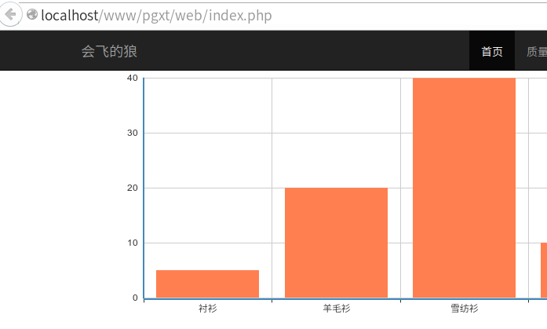

# 第二章 Yii 2 加入百度 echarts 的一般步骤

* 原作者：oschina网友-[不避风云](http://my.oschina.net/bubifengyun)

* 原网址：[http://my.oschina.net/bubifengyun/blog/514466](http://my.oschina.net/bubifengyun/blog/514466)

* GitHub：[https://github.com/hisune/Echarts-PHP](https://github.com/hisune/Echarts-PHP)

部分内容有改动。

参考[这里](https://github.com/hisune/Echarts-PHP)。

对于联网的网站，可以采用上述[网址](https://github.com/hisune/Echarts-PHP)里的做法。下面叙述对无法联网的或者想把echarts下载后放在自己网站离线使用的做法。

百度的echarts为JavaScript/CSS包，采用Bower管理。可以采用如下方式在YII2中使用。
假设你的网站目录为*./basic*。

## 1 安装百度echarts

或者可以替代1-3步骤。使用composer安装。

```php
composer require bower-asset/echarts "*"
```


## 2. 创建asset bundle类。

在目录*./basic/assets/*创建EchartsAsset.php文件。内容如下。

```php

/**
 * Write Asset for Echarts.
 */

namespace app\assets;

use yii\web\AssetBundle;

class EchartsAsset extends AssetBundle
{
	public $sourcePath = '@bower/echarts/build/dist';
    public $js = [
		'echarts.js',
    ];
}
```

内容参照AssetBundle的教程做的。通过查阅echarts的教程，发现一般他们调用的都是*./echarts/build/dist/*的内容，所以文中设置*$sourcePath*指向该文件夹。
其中*@bower*，YII2会自动找到*./basic/vendor/bower/*文件夹的。
*$js*是查找*./echarts/build/dist/*下的*js*文件，列出来的。
这样完成了AssetBundle的配置。

## 3. 安装Echarts-PHP插件。
在目录*./basic/*下输入命令

```bash
composer require "hisune/echarts-php"
```

或者类似的命令或者直接在[github](https://github.com/hisune/Echarts-PHP)下载，
解压缩放在目录*./basic/vendor/*下。

## 4. 输出echarts图像。

下面举个简单的例子。
打开*site/index.php*文件。

```bash
vi ./basic/views/site/index.php
```

加入如下内容

```php

<?php 
use app\assets\EchartsAsset;
use Hisune\EchartsPHP\ECharts;

$asset=EchartsAsset::register($this);
$chart = new ECharts($asset->baseUrl);
$chart->tooltip->show = true;
$chart->legend->data = array('销量');
$chart->xAxis = array(
    array(
        'type' => 'category',
        'data' => array("衬衫","羊毛衫","雪纺衫","裤子","高跟鞋","袜子")
    )
);
$chart->yAxis = array(
    array('type' => 'value')
);
$chart->series = array(
    array(
        'name' => '销量',
        'type' => 'bar',
        'data' => array(5, 20, 40, 10, 10, 20)
    )
);
echo $chart->render('simple-custom-id');
```

解说：
第一第二行代码是加入我们需要的类EchartsAsset跟EchartsPHP。

第三行空，第四行第五行注册EchartsAsset类，并把注册后的*baseUrl*传递给EchartsPHP类，供查找*JavaScript/CSS*文件的位置。

第六行及以后赋值，这个可以参考百度的Echarts实例跟EchartsPHP的配置。自己找规律。

最后一行，输出图像。

## 5. 图像显示



## 附录一 手动安装echarts

如果你没有安装好`composer`可以采用如下手动安装echarts。

### 1. 下载echarts。
下载[百度](http://echarts.baidu.com/)的echarts-2.2.1.zip压缩包，解压缩后放在
*./basic/vendor/bower/echarts-2.2.1/*下。

### 2. 重命名echarts(非必须)。
查看目录*./basic/vendor/bower/echarts-2.2.1/*下面应该有*build,src,doc*等文件夹以及*bower.json,LICENSE.txt*等文件。为方便使用，把文件夹*echarts-2.2.1*改为*echarts*。

### 3. 修改*composer.json*文件。

```bash
vi ./basic/composer.json
```

找到***require***这一项，应该有类似如下的内容。

```
    "require": {
        "php": ">=5.4.0",
        "yiisoft/yii2": "2.0.6",
        "yiisoft/yii2-bootstrap": "*",
        "yiisoft/yii2-swiftmailer": "*",
        "phpoffice/phpexcel": "^1.8"
    },
```

在最后一行加入***"bower-asset/echarts": "2.2.1"***，
变成如下形式。

```
    "require": {
        "php": ">=5.4.0",
        "yiisoft/yii2": "2.0.6",
        "yiisoft/yii2-bootstrap": "*",
        "yiisoft/yii2-swiftmailer": "*",
        "phpoffice/phpexcel": "^1.8",
	    "bower-asset/echarts": "2.2.1"
    },
```
## 附录二 echarts饼状图例子

来一个饼状图的例子。

```php
$asset = EchartsAsset::register($this);
$chart = new ECharts($asset->baseUrl);

$chart->title = [
	'text' => '成绩分布',
	'subtext' => '纯属虚构',
	'x' => 'center',
];
$chart->tooltip = [
	'trigger' => 'item',
	'formatter' => "{a}<br/>{b}:{c}({d}%)"
];
$chart->legend = [
	'orient' => 'vertical',
	'x' => 'left',
	'data' => ['优秀','良好','一般','及格','不及格'],
];
$chart->toolbox = [
        'show' => true,
        'feature' => [
            'mark' => ['show' => true],
            'dataView' => ['show'=> true, 'readOnly'=> false],
            'magicType' => [
                'show'=> true, 
                'type'=> ['pie', 'funnel'],
                'option'=> [
                    'funnel'=> [
                        'x'=> '25%',
                        'width'=> '50%',
                        'funnelAlign'=> 'left',
                        'max'=> 1548
                    ]
                ]
            ],
            'restore' => ['show'=> true],
            'saveAsImage' => ['show'=> true]
        ]
    ];
$chart->calculable = true;
$chart->series = [
	[
		'name'=>'成绩分布',
		'type'=>'pie',
		'radius' => '55%',
		'center'=> ['50%', '60%'],
		'data'=>[
			['value'=>335, 'name'=>'优秀'],
			['value'=>310, 'name'=>'良好'],
			['value'=>1548, 'name'=>'一般'],
			['value'=>234, 'name'=>'及格'],
			['value'=>135, 'name'=>'不及格'],
		]
	]
];
<?=$chart->render('advance-custom-id')?>
```