# 关于怎么为本书做贡献

您可以通过在 github 或者 gitee 为本书贡献内容，或者直接发邮件给我，都可以。
本书的两个同步更新源：

+ https://github.com/bubifengyun/book-yii2-dev-process
+ https://gitee.com/bubifengyun/book-yii2-dev-process

如果您觉得实在麻烦，也可以采用 doc, markdown 等发给我，我的邮箱 bubifengyun@sina.com。

本章主要是为对 git 不熟悉的读者写的。如果您已经非常熟悉 git，并且有 github 或者 gitee(码云) 的账户，可以跳过本章。

考虑到大家来自不同单位，认识水平不同，对英语的熟悉程度也不同。为了方便大家使用，把本书的源码放在了[码云](https://gitee.com/)上，均为中文界面，方便操作，如有不懂，可以面谈。

如果大家已经有该码云的账户，就可以跳过下面注册这一节，直接到登录使用那一节。

如果你英文比较好，或者想挑战一下英语水平，也可以直接在[github](https://github.com/bubifengyun/book-yii2-dev-process)上编辑本书。在[码云](https://gitee.com/bubifengyun/book-yii2-dev-process)和 [github](https://github.com/bubifengyun/book-yii2-dev-process) 上，本书草稿保持同步更新。

关于 markdown 语法说明可以参考如下网页：

- https://www.cnblogs.com/yabin/p/6366151.html
- https://cuileon.github.io/md-editor/

## 一、注册账户（码云）

打开[码云](https://gitee.com/)页面：https://gitee.com/ 。通常情况下，打开的都是中文界面，如下图所示。

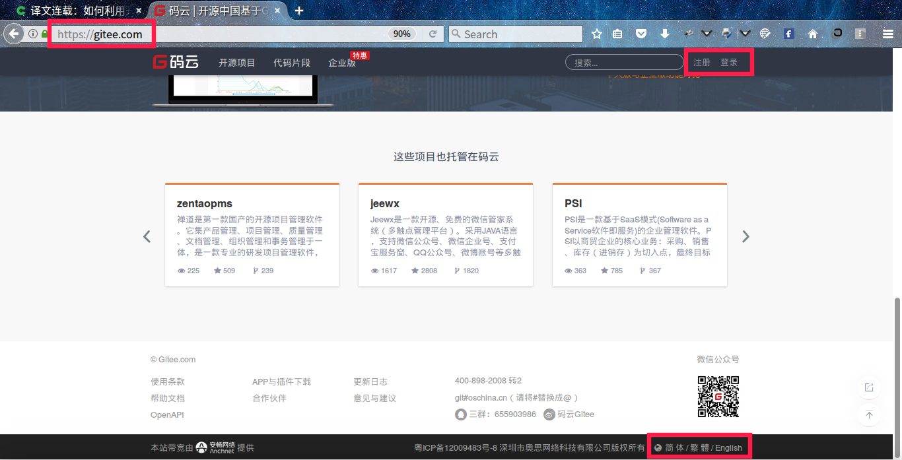

如果不是中文简体，把页面滚到最后，如上图所示，选择简体即可。如果已经是中文了，则无需改动。接下来点击右上角的注册按钮，跳转到注册页面，如下图所示。开始注册账户。

填上相关信息即可，然后在自己的注册邮箱里激活该账户，就可以直接去登录了。

## 二、登录使用（码云）

点击网页右上角的登录按钮，到登录页面输入刚刚注册的账户密码就可以登录使用了。接着访问[本书草稿](https://gitee.com/bubifengyun/book-yii2-dev-process)的页面：https://gitee.com/bubifengyun/book-yii2-dev-process

如下图所示。

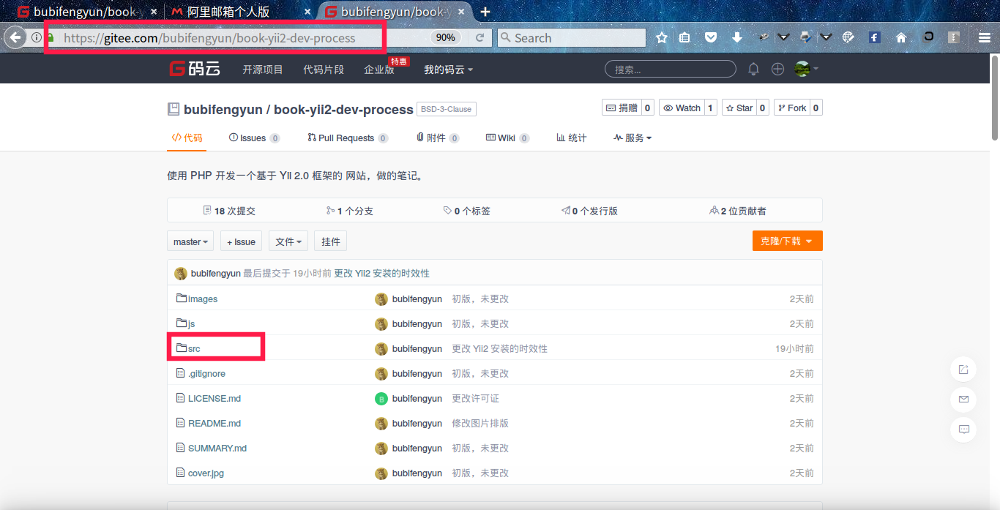

找到 *./src* 文件夹，点击进入。就可以看到已经列好的各个章节了。点击你想查看的章节，即可在线直接阅读。

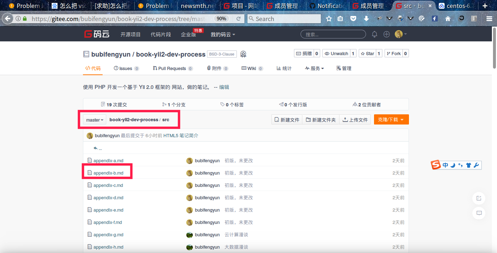

对这篇内容，如果你想添加一些备注，可以点击 `issues`按钮，如下图所示。

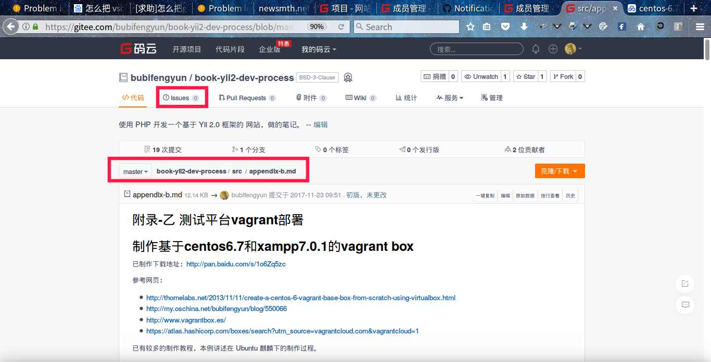

编辑框是支持 MarkDown 语法的。你可以把你需要编辑的内容写下来。

关于怎么注册登录 github 的部分就不介绍了。接下来讲述在 [github](https://github.com/bubifengyun/book-yii2-dev-process) 上怎么修改本书的草稿。

## 三、通过 issues （github）

假设你已经注册并登录了自己的账户，访问[本书 github 草稿](https://github.com/bubifengyun/book-yii2-dev-process),如下图所示，点击 `issues` 按钮，看到如下界面，点击 `New Issue`。

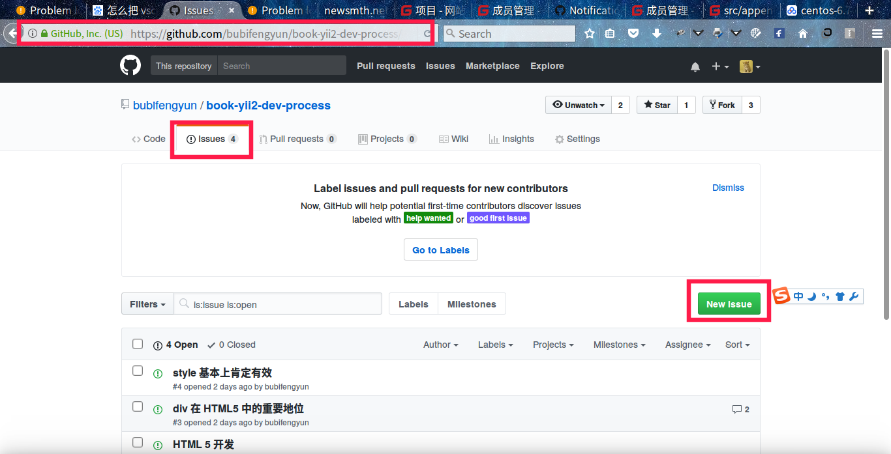

会进入这么一个页面。

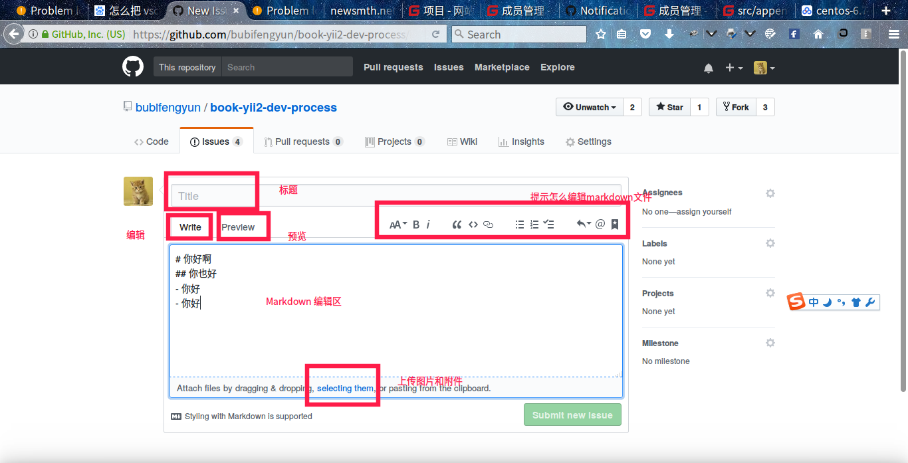

除去少有的几个英文单词，你会发现在这里更容易编辑代码，而且，会有提示你怎么加粗，怎么预览的功能，甚至上传图片的功能。完成后，右下角点击绿色按钮就可以提交了。

## 四、直接编辑文件（github）

如果你想修改某个文件，点击进入这个文件页面。点击图标为铅笔的编辑按钮。如下图所示。

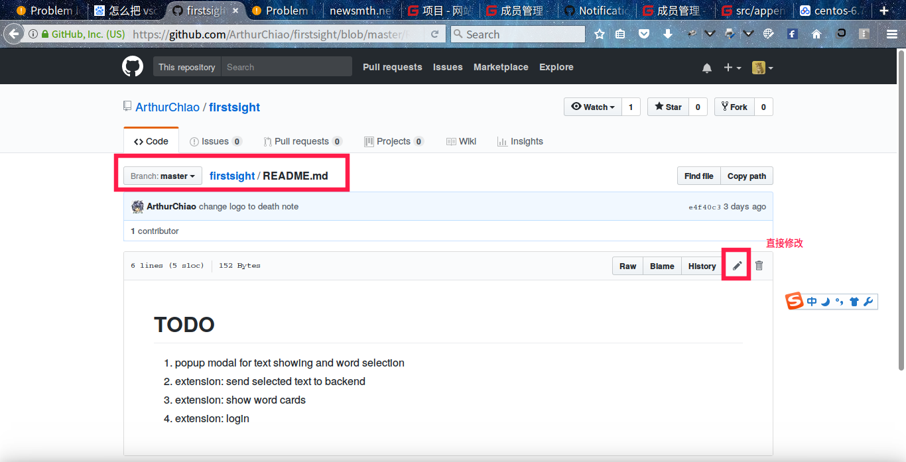

进入到如下界面，就可以编辑文件了，编辑完成后，修改说明的地方备注一下。点击 `propose file change` 推送文件修改按钮。相当于刚刚修改的文件已经保存好了。

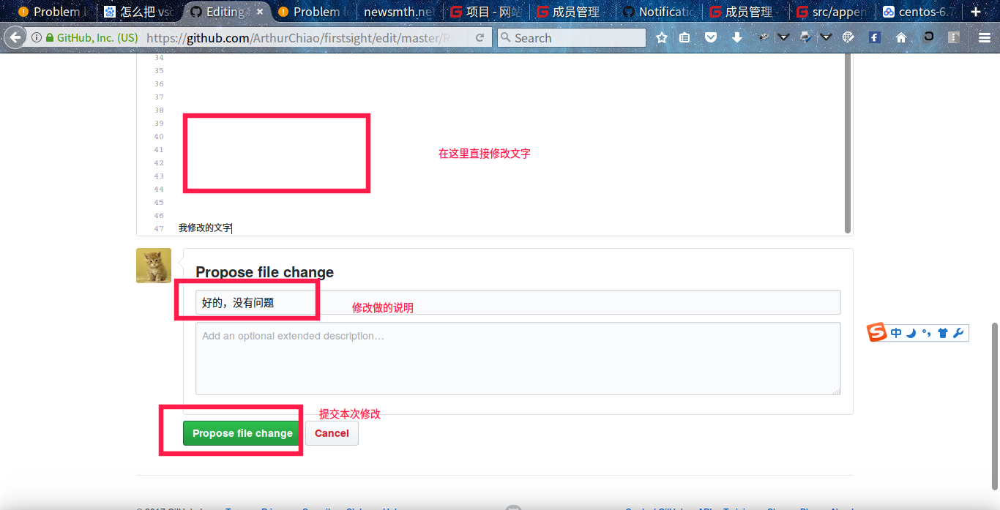

接下来需要创建合并请求。上面一步完成后，会跳转到创建合并请求页面，如下图所示。点击 `create pull request` 创建合并请求按钮，图中被红框圈住的绿色按钮。

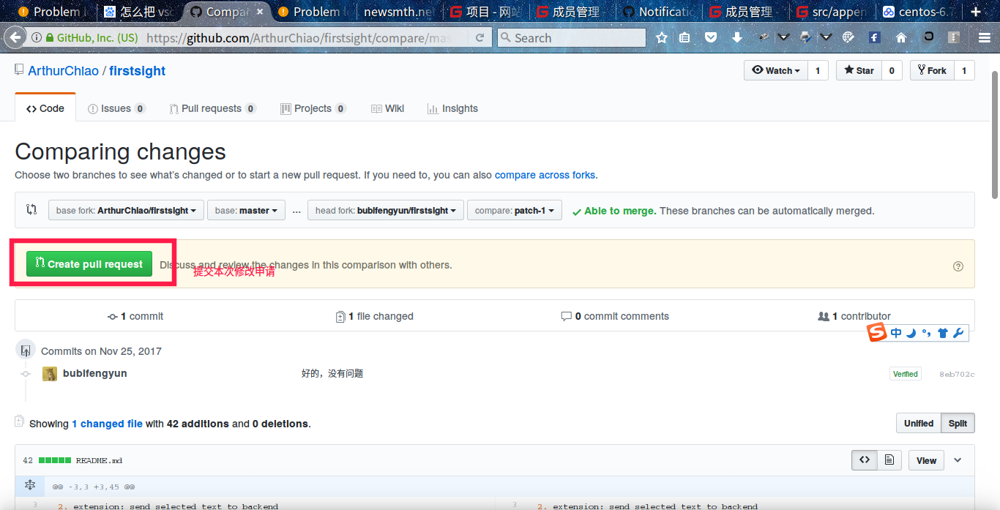

进入到创建合并请求的页面，说明本次合并请求的说明，并点击`create pull request`创建合并请求按钮，就成功发送合并请求了。

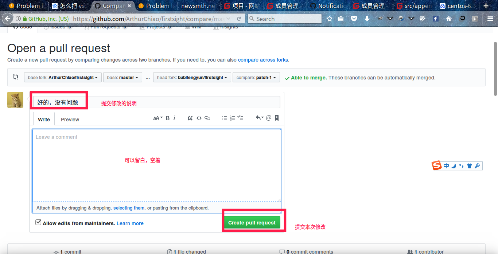

下图是成功发送合并请求后的界面。

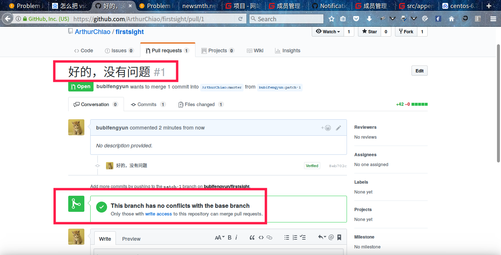

这样就可以了，剩下的交给我处理就可以了。